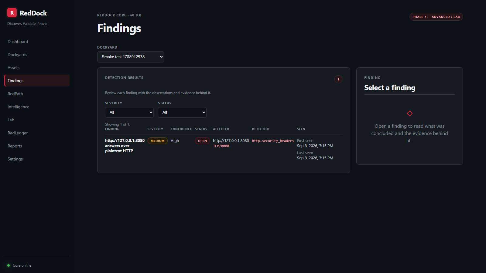
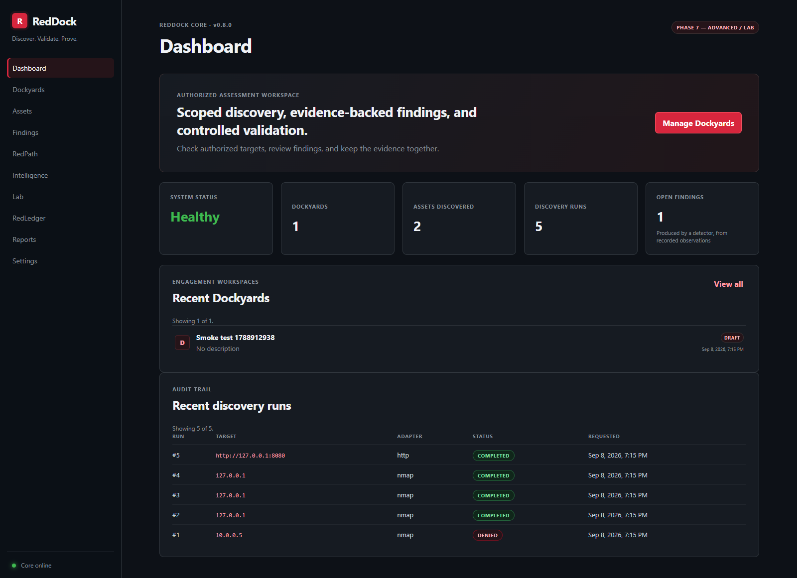
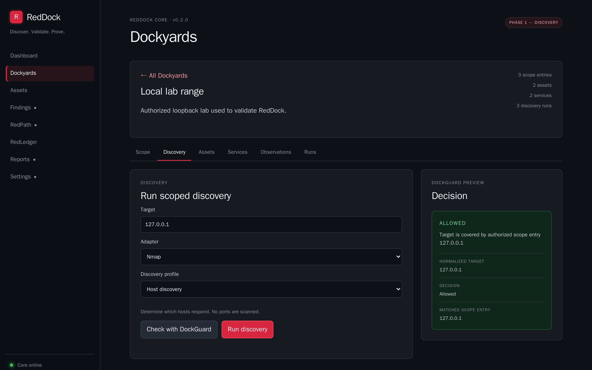
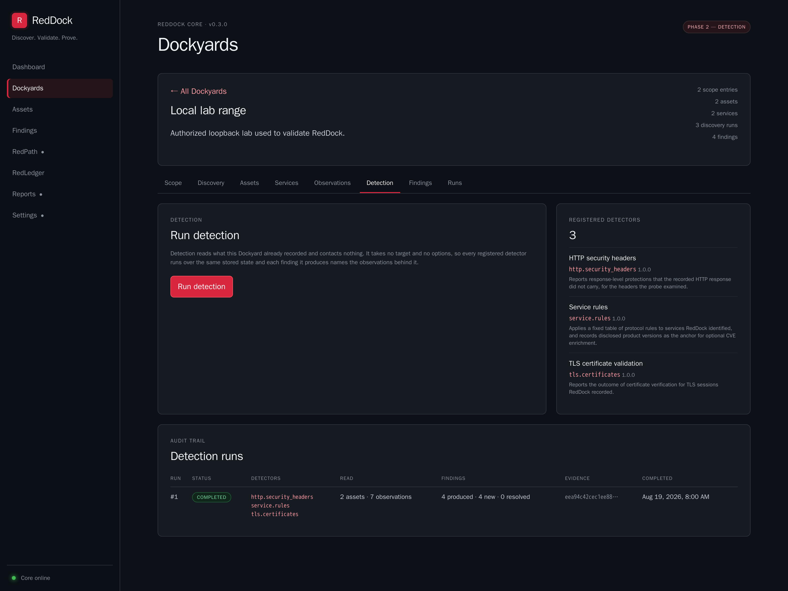
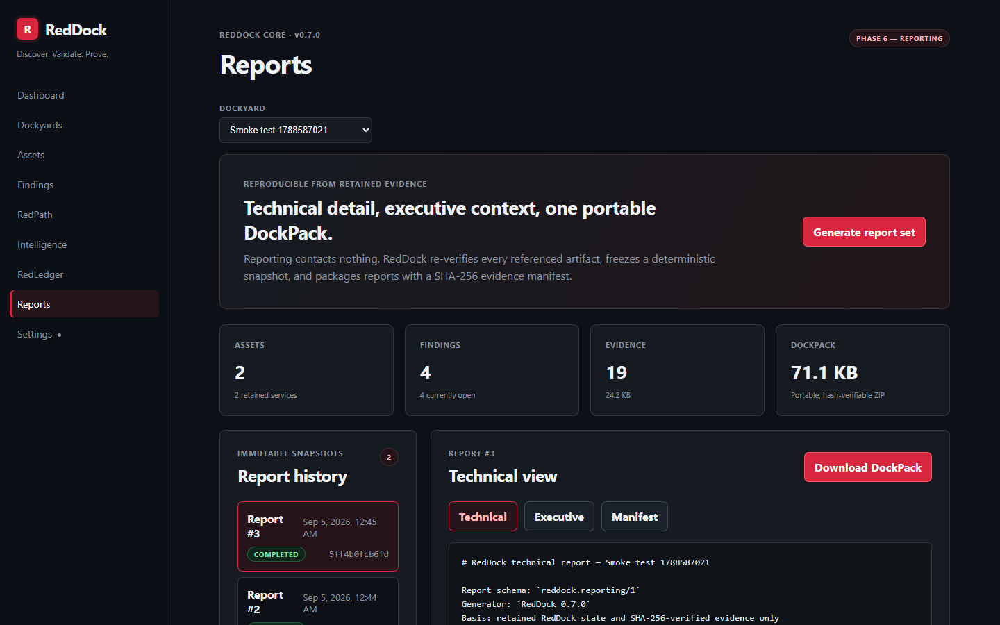
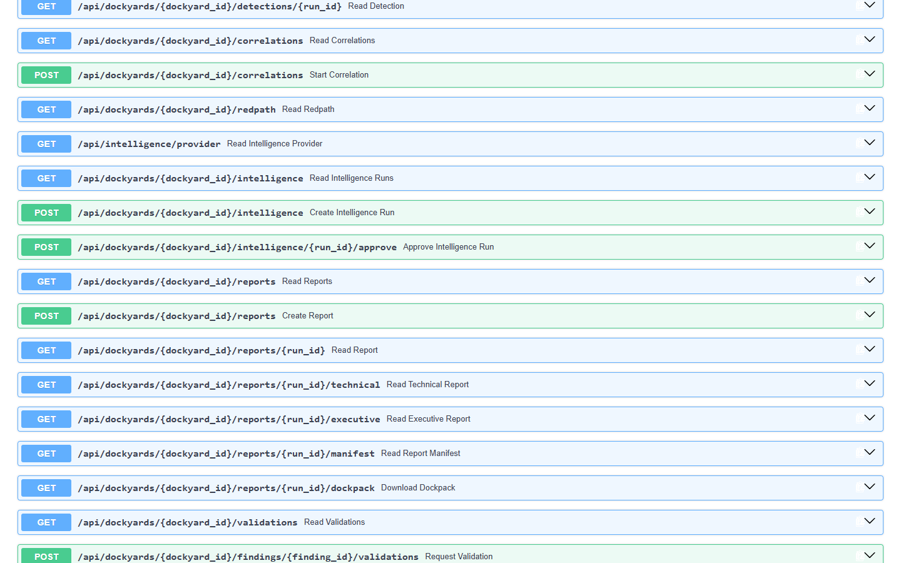
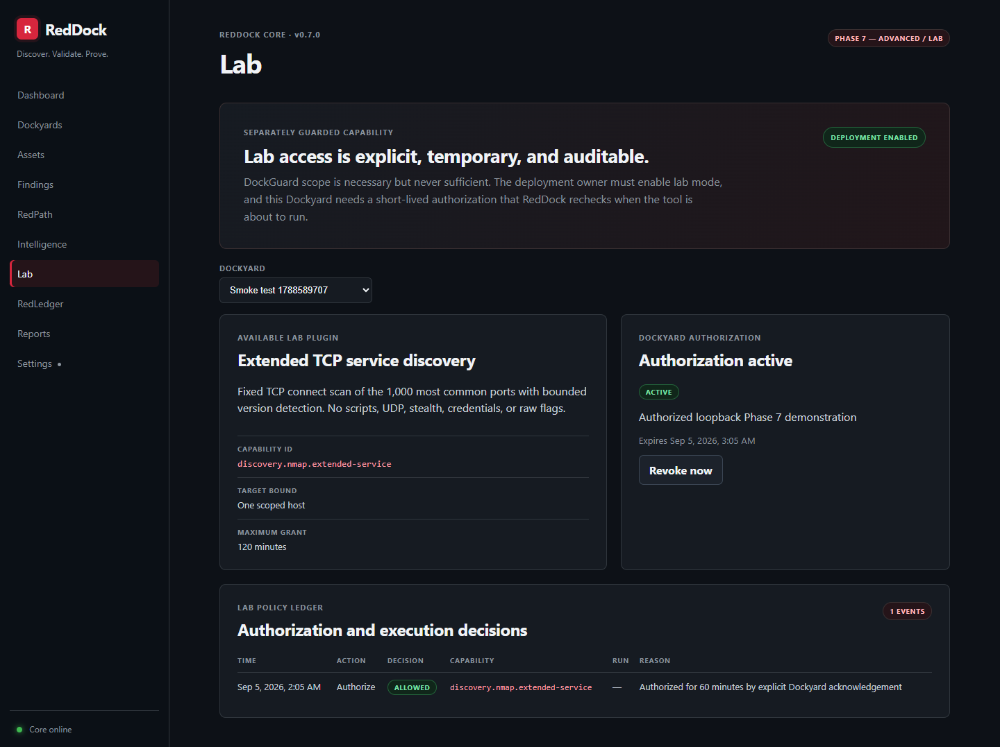
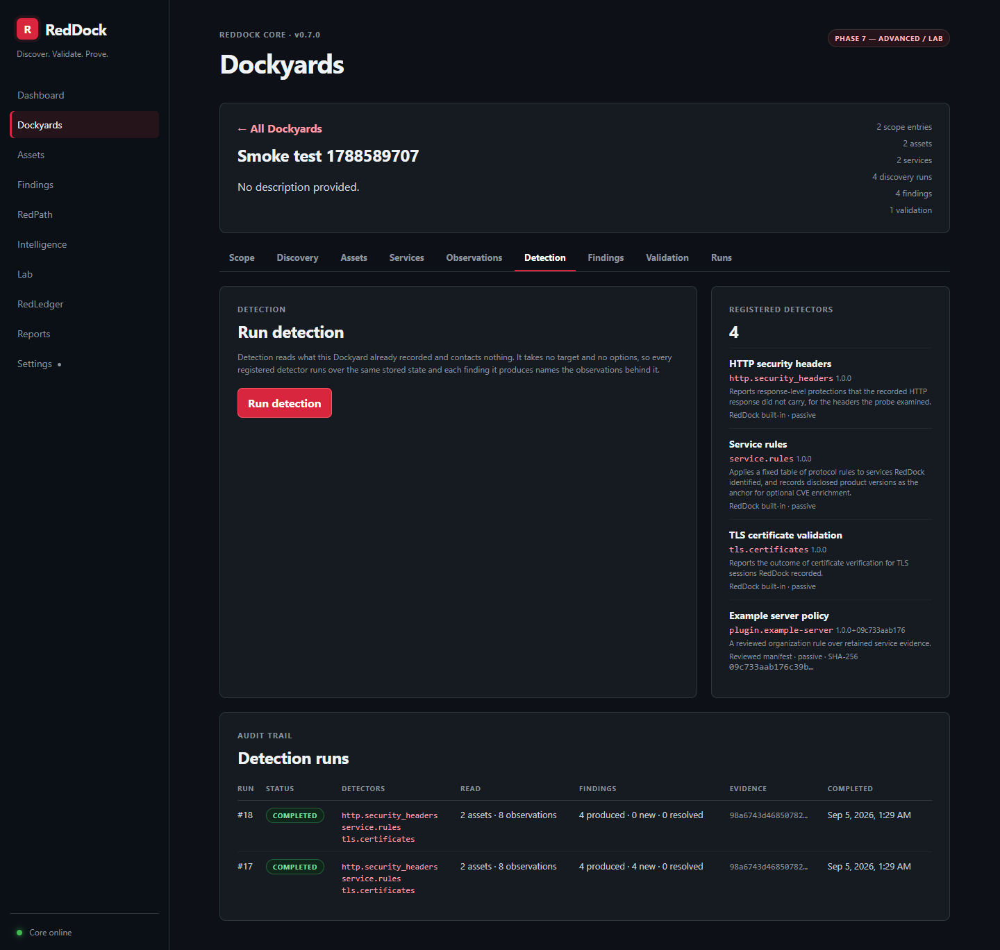
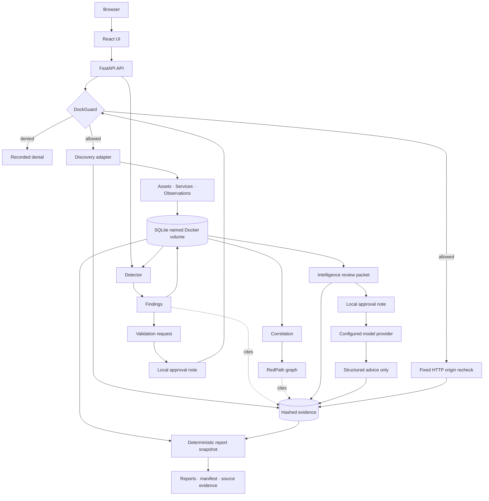

<div align="center">

# RedDock

**Discover. Validate. Prove.**

Container-native security assessment and validation platform with controlled execution and evidence-backed findings.

[](https://github.com/chriswayneh/RedDock/tags)
[](https://docs.docker.com/compose/)
[](https://www.python.org/)
[](https://github.com/chriswayneh/RedDock/actions/workflows/ci.yml)
[](LICENSE)
[](ROADMAP.md)

**Current release:** [v0.7.0](https://github.com/chriswayneh/RedDock/releases/tag/v0.7.0) — Phase 6 Reporting

**Development on `master`:** Phase 7 lab controls and data-only detector plugins are in progress.

[Quick Start](#quick-start) · [Current Capabilities](#what-you-get) · [Architecture](#architecture) · [Security](#security-by-design) · [Roadmap](ROADMAP.md) · [Contributing](CONTRIBUTING.md)

</div>

---

## What This Is

RedDock explores how security tooling can become portable, container-native, policy-controlled, reproducible, and evidence-driven instead of a collection of host-specific scripts. It is designed for authorized environments and intentionally grows through small, verified phases.

Its operating model is simple: **AI proposes. Policy authorizes. Tools execute. Evidence proves.** An explicit authorized scope and DockGuard control every target, non-invasive discovery produces hashed evidence, deterministic detectors turn observations into traceable findings, and validation is limited to an approval-gated recheck of a narrow class of HTTP finding. Optional intelligence can send one reviewed, evidence-linked packet to an operator-configured model for structured advice; it has no tools and cannot act. Reporting then turns retained state into reproducible technical and executive reports plus a portable, hash-verifiable DockPack. There is no exploitation, credential attack, or payload of any kind.

## What You Get

| Capability | Current implementation |
| --- | --- |
| Runtime | One Dockerized application that serves the UI and API on the same origin |
| API explorer | OpenAPI 3.1 schema with interactive Swagger UI at `/docs` |
| Workspaces | Dockyards that own an explicit authorized scope |
| Scope policy | DockGuard evaluates every target deterministically and fails closed |
| Discovery | Nmap host and TCP service discovery, plus a single-request HTTP origin probe |
| Inventory | Normalized assets and services that reconcile across repeat discovery |
| Observations | Dated, adapter-attributed records of what was seen — never findings |
| Detection | Deterministic detectors that read stored observations and reach nothing |
| Findings | Normalized conclusions with separate severity and confidence, deduplicated by fingerprint |
| Lifecycle | Findings resolve rather than disappear, and operator decisions survive later runs |
| Validation | A separately approved, fixed HTTP-origin recheck for eligible open header findings |
| Correlation | Evidence-linked asset/finding relationships and fixed CWE classifications |
| RedPath | A graph where every edge explains its basis and names its supporting SHA-256 evidence |
| Intelligence | Optional, approval-gated model advice over an exact packet the operator reviews first |
| Local AI | Qwen3.5 4B through Ollama is the recommended default; any compatible provider remains configurable |
| Reporting | Deterministic technical and executive reports over one bounded retained snapshot |
| DockPack | Portable ZIP export with a member manifest and verified source evidence |
| CVE enrichment | A boundary with an optional local catalogue; an association, never a verdict |
| Evidence | SHA-256-hashed run artifacts, validation packages, intelligence provenance, and reporting manifests |
| Persistence | SQLite and evidence stored in a named Docker volume |
| Safety | Non-invasive profiles only; no scripting, brute force, evasion, or exploitation |
| Lab controls | Deployment opt-in plus a separate, short-lived per-Dockyard authorization and audit ledger |
| Extensions | Data-only detector manifests with strict schema checks and content-addressed provenance |

## Screenshots

<div align="center">



<sub>Findings: severity and confidence stated separately, with the detector, the observation, and the SHA-256 that supports each one.</sub>

<br><br>



<sub>The dashboard: workspace metrics and the discovery audit trail, including a run DockGuard denied.</sub>

<br><br>



<sub>The Dockyard workspace: a target must pass DockGuard before discovery can be launched.</sub>

<br><br>



<sub>Detection: the registered detectors, what each of them reads, and what a completed run produced.</sub>

<br><br>



<sub>Reporting: one retained snapshot becomes reviewable reports, a complete evidence manifest, and a portable DockPack.</sub>

<br><br>



<sub>API explorer: the OpenAPI 3.1 contract is available through the built-in Swagger UI.</sub>

<br><br>



<sub>Phase 7 lab policy: deployment opt-in, temporary per-Dockyard authorization, fixed capability bounds, immediate revocation, and the audit ledger in one view.</sub>

<br><br>



<sub>Detector provenance: reviewed built-ins and a data-only organization rule publish their source, passive execution model, content-addressed version, and manifest hash.</sub>

</div>

## Quick Start

Docker Engine or Docker Desktop with Docker Compose is the supported way to run RedDock. Nmap ships inside the image; nothing is installed on your host.

```bash
git clone https://github.com/chriswayneh/RedDock.git
cd RedDock
docker compose up --build
```

Open [http://localhost:8080](http://localhost:8080). The health endpoint is [http://localhost:8080/api/health](http://localhost:8080/api/health), and interactive API documentation is at [http://localhost:8080/docs](http://localhost:8080/docs).

Stop the application with `docker compose down`. The `reddock-data` volume holds both the database and retained evidence and survives normal container recreation; use `docker compose down -v` only when you deliberately want to erase local data.

### Optional intelligence provider

Intelligence is off by default. The recommended local option is Qwen3.5 4B
through Ollama; `compose.ollama.yaml` enables that path explicitly without
bundling model weights. Any OpenAI-compatible local or cloud model remains an
operator choice. See [Local and configurable AI](docs/LOCAL_AI.md) for setup,
provider overrides, data-boundary rules, and the approval flow.

### Optional Phase 7 controls

Lab capabilities require both a deployment-owner switch and a short-lived
per-Dockyard authorization; the API cannot enable the deployment switch. See
[Lab mode](docs/LAB_MODE.md). Organization-specific detector policy can be
installed only as bounded, data-only JSON manifests—never executable plugin
code. See [Detector plugins](plugins/README.md).

## How It Works

1. Create a Dockyard to represent an authorized engagement workspace.
2. Define its authorized scope: included targets, and exclusions that always win.
3. Enter a target and ask DockGuard for a decision. It answers `ALLOWED` or a specific denial with the reason and the scope entry that decided it.
4. Run a safe discovery profile. The server re-evaluates DockGuard immediately before the adapter is invoked, so an out-of-scope target is never reached.
5. Results normalize into assets, services, and observations, and the run's raw output, normalized result, and metadata are retained and hashed.
6. Run detection. It contacts nothing: every registered detector reads what the Dockyard already recorded and returns findings, each naming the rule that produced it and the observations it was drawn from.
7. For an eligible open HTTP security-header finding, request validation. This records intent only. Add an approval note to recheck DockGuard immediately before RedDock sends its fixed, bodyless HTTP probe; the raw response summary, normalized conclusion, metadata, and manifest are retained as a hash-linked evidence package.
8. Run correlation. RedDock reads only stored assets, findings, observations, and hashes, then renders an explainable RedPath graph and fixed CWE classifications without contacting a target.
9. Optionally create an intelligence packet from the latest correlation. RedDock stores and hashes the exact JSON without contacting a provider. Review it and the destination, then add a separate approval note to request structured remediation and prioritization advice.
10. Generate a report snapshot. RedDock re-verifies retained evidence, renders technical and executive reports, builds a manifest, and packages the exact source artifacts into a reproducible DockPack without contacting a target or model.
11. In an isolated authorized lab, optionally enable the deployment gate and create a short-lived Dockyard grant before using the fixed extended service-discovery profile. Every authorization and decision remains in the lab audit ledger.

Run the same discovery again and RedDock updates what it already knows rather than duplicating it, while every observation is kept as history. Run detection again and the same issue stays one finding whose `last_seen` moves, while an issue that is no longer reproduced is marked resolved rather than quietly removed.

## Architecture



Discovery and the tightly bounded validation recheck are the only paths that touch a target, and both pass DockGuard immediately before contact. Detection, correlation, and reporting read only stored state. Intelligence may contact only the configured model provider after the operator reviews the exact retained packet and records a separate approval. It receives no target or tool capability. A validation or intelligence request alone makes no network contact, and reporting never does.

The production image builds the React application and serves it from the same FastAPI process that exposes `/api`. There is deliberately no reverse proxy, separate frontend service, queue, or remote dependency; discovery runs on a small bounded thread pool inside the application and detection runs inline. See [ARCHITECTURE.md](ARCHITECTURE.md) for the scope model, the adapter and detector boundaries, and the trust boundaries.

## Security by Design

> **AI proposes. Policy authorizes. Tools execute. Evidence proves.**

- **Scope is explicit and server-enforced.** DockGuard evaluates every target twice — when the run is requested and again immediately before the tool is invoked. The UI cannot bypass it.
- **Denials are specific.** `denied_out_of_scope`, `denied_excluded`, `invalid_target`, and `unresolved` each carry the reason and the matching scope entry.
- **Fail closed.** Anything DockGuard cannot positively place inside the authorized scope is denied, including a scope it cannot parse.
- **Names and addresses stay separate.** A hostname is never authorized because it resolves into an authorized network, and there is no wildcard or subdomain expansion.
- **Tools never receive operator flags.** Argument vectors are generated internally from a fixed table of safe options, executed without a shell, bounded by timeouts, and built only from targets normalized to a character set that cannot form an option.
- **Dangerously broad scope is rejected.** A scope entry may not cover more than 256 addresses, and a default route is never valid.
- **Observations are not findings.** An observation records what an adapter saw and carries no severity or verdict. A finding is a separate thing: a normalized conclusion one named detector drew, which cannot exist without the observations it cites.
- **Detectors reach nothing.** A detector is handed an immutable snapshot and no session, socket, subprocess, target, or operator option. A test parses the detection package and fails the build if that stops being true.
- **A finding is checkable.** It names the detector and rule that produced it, the observations behind it, the runs involved, and the SHA-256 of the retained artifact.
- **Validation is deliberately smaller than a scanner.** It applies only to eligible open HTTP header findings, targets their recorded origin, accepts no URL, payload, credential, cookie, command, or option, follows no redirect, reads no body, and requires a separate approval note. DockGuard is re-evaluated immediately before its single fixed probe.
- **Ratings are not inflated.** Severity and confidence are separate fields, missing hardening headers are `low`, and there is no risk score, CVSS vector, or aggregate rating, because RedDock does not compute one.
- **CVE data is never invented.** RedDock downloads none. Enrichment is optional, local, exact-match only, and never changes a severity or a status.
- **Correlation asserts only what evidence supports.** Exact stored identifiers produce relationships; every RedPath edge explains its basis and carries its evidence hash. No edge claims reachability, exploitability, causation, or risk.
- **Intelligence is a reviewable disclosure, not an agent.** It is disabled by default. The operator sees the exact evidence-linked packet and configured destination before separately approving transmission. The model gets no tools, targets, credentials, commands, or state-changing API, and its structured references must already exist in the packet.
- **Reports prove their inputs.** Reporting accepts no operator-selected path or source. It freezes database state under one consistent transaction, refuses active source runs, verifies every included artifact against its retained hash, confines portable names, applies pre-allocation size/count limits, renders stored text literally, and rechecks a DockPack before download.

Read [SECURITY.md](SECURITY.md) for the authorized-use policy and the full control list.

## Repository Structure

```text
backend/       FastAPI API, DockGuard, adapters, detectors, intelligence, reporting, evidence, and SQLite
frontend/      React and TypeScript dashboard
scripts/       Local end-to-end smoke test
docs/          Architecture decisions and project documentation
.github/       Continuous-integration workflow
```

## Documentation

| Document | Purpose |
| --- | --- |
| [Architecture](ARCHITECTURE.md) | Current system boundaries and future design seams |
| [Security](SECURITY.md) | Authorized-use policy and product safety model |
| [Roadmap](ROADMAP.md) | Phased delivery plan and clear separation of planned work |
| [Local AI](docs/LOCAL_AI.md) | Recommended Ollama model and compatible-provider configuration |
| [Lab mode](docs/LAB_MODE.md) | Independent gates, fixed capability, and audit behaviour |
| [Detector plugins](plugins/README.md) | Data-only extension schema, install path, limits, and trust model |
| [Contributing](CONTRIBUTING.md) | Local checks and contribution guidelines |
| [Changelog](CHANGELOG.md) | Release history |
| [DockPack format](docs/DOCKPACK.md) | Portable report and evidence package layout and verification |

## Project Status

**v0.7.0 delivers Phase 6 — Reporting:** deterministic technical and executive reports, a complete SHA-256 evidence manifest, and portable DockPack exports assembled only from verified retained artifacts. Unchanged Dockyard state produces byte-identical output, and reporting contacts neither a target nor a model.

**v0.6.0 delivered Phase 5 — Intelligence:** opt-in local or cloud OpenAI-compatible advice, exact packet review before disclosure, separate approval, provider and prompt-version binding, strict output validation, and hashed input/output provenance. The model receives no tools and cannot change RedDock state.

**v0.5.0 delivers Phase 4 — Correlation:** stored-state-only correlation snapshots, exact-address asset relationships, evidence-linked finding correlations, fixed CWE mappings, and the RedPath graph.

**v0.4.0 delivered Phase 3 — Validation:** an approval-gated, scope-rechecked, non-destructive HTTP-origin recheck for eligible open security-header findings, with `confirmed`, `not_reproduced`, or `indeterminate` outcomes, separate confidence, and a hashed raw/normalized/metadata/manifest evidence package.

**v0.3.0 delivered Phase 2 — Detection:** the detector contract and registry, detection runs, normalized findings with separate severity and confidence, deduplication by stable fingerprint, a lifecycle that resolves rather than deletes, evidence links from every finding back to the observations and hashes behind it, and the CVE enrichment boundary.

**v0.2.1 finalized Phase 1** with consistent version metadata across the application, API, and packages.

**v0.2.0 delivered Phase 1 — Discovery:** DockGuard scope enforcement, asset/service/observation models, the Nmap and HTTP discovery adapters, discovery-run auditing, and the RedLedger evidence foundation.

**v0.1.0 delivered Phase 0 — Foundation:** a containerized React/FastAPI application, local Dockyard persistence, a dashboard, documentation, tests, and CI.

**Next after v0.7.0: Phase 7 — Advanced / Lab.** Explicit lab-only capabilities and a broader plugin ecosystem remain planned and must be separately guarded. See the [roadmap](ROADMAP.md) for the complete phased plan.

## Contributing and Security

RedDock is MIT-licensed and owner-directed. Bug reports and design discussion are welcome, but unsolicited external pull requests are not currently accepted so the safety model and phase boundaries remain controlled. See [CONTRIBUTING.md](CONTRIBUTING.md), and report potential vulnerabilities through [SECURITY.md](SECURITY.md) or GitHub Private Vulnerability Reporting.

## Development Approach

RedDock is human-directed and intentionally uses a mixed-AI engineering
workflow. Claude Code and OpenAI Codex have both contributed implementation and
review work; repository source, tests, security controls, and owner review—not
model output—remain the authority for what ships.

## License

[MIT](LICENSE).

## Built With

[Python](https://www.python.org/) · [FastAPI](https://fastapi.tiangolo.com/) · [Pydantic](https://docs.pydantic.dev/) · [SQLAlchemy](https://www.sqlalchemy.org/) · [SQLite](https://www.sqlite.org/) · [Nmap](https://nmap.org/) · [React](https://react.dev/) · [TypeScript](https://www.typescriptlang.org/) · [Vite](https://vite.dev/) · [Docker](https://www.docker.com/) · [GitHub Actions](https://github.com/features/actions)

<br>

<p align="center">
  <strong>Discover. Validate. Prove.</strong><br>
  <sub>Controlled security validation, built one verified phase at a time.</sub>
</p>
