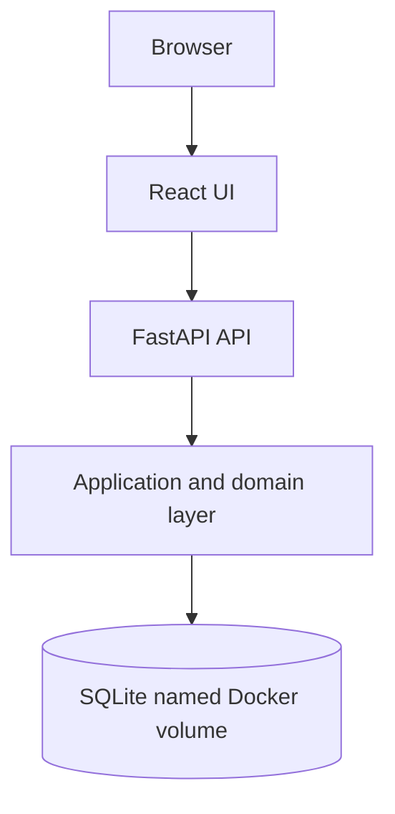

<div align="center">

# RedDock

**Discover. Validate. Prove.**

Container-native security assessment and validation platform with controlled execution and evidence-backed findings.

[](https://github.com/chriswayneh/RedDock/tags)
[](https://docs.docker.com/compose/)
[](https://www.python.org/)
[](https://github.com/chriswayneh/RedDock/actions/workflows/ci.yml)
[](LICENSE)
[](ROADMAP.md)

**Current release:** [v0.1.0](https://github.com/chriswayneh/RedDock/tags) — Phase 0 Foundation · Active development

[Quick Start](#quick-start) · [Current Capabilities](#what-you-get) · [Architecture](#architecture) · [Security](#security-by-design) · [Roadmap](ROADMAP.md) · [Contributing](CONTRIBUTING.md)

</div>

---

## What This Is

RedDock explores how security tooling can become portable, container-native, policy-controlled, reproducible, and evidence-driven instead of a collection of host-specific scripts. It is designed for authorized environments and intentionally grows through small, verified phases.

Its operating model is simple: **AI proposes. Policy authorizes. Tools execute. Evidence proves.** Phase 0 establishes the foundation for that model; it includes no scanning, vulnerability detection, exploitation, credential attacks, payloads, AI integration, or autonomous offensive actions.

## What You Get

| Capability | Phase 0 implementation |
| --- | --- |
| Runtime | One Dockerized application that serves the UI and API on the same origin |
| API | FastAPI health, version, and Dockyard endpoints with generated OpenAPI docs |
| UI | React and TypeScript dashboard for the current workspace state |
| Persistence | SQLite stored in a named Docker volume |
| Workspaces | Create, list, and inspect Dockyards for authorized engagement organization |
| Safety | A deliberately limited foundation with no active security execution |

## Dashboard

<div align="center">


<sub>RedDock Phase 0 running locally with an empty Dockyard state.</sub>

</div>

## Quick Start

Docker Engine or Docker Desktop with Docker Compose is the supported way to run Phase 0.

```bash
git clone https://github.com/chriswayneh/RedDock.git
cd RedDock
docker compose up --build
```

Open [http://localhost:8080](http://localhost:8080). The health endpoint is [http://localhost:8080/api/health](http://localhost:8080/api/health), and interactive API documentation is at [http://localhost:8080/docs](http://localhost:8080/docs).

Stop the application with `docker compose down`. The `reddock-data` volume survives normal container recreation; use `docker compose down -v` only when you deliberately want to erase local data.

## How It Works

1. Start RedDock with Docker Compose; the application initializes its local SQLite data store.
2. Create a Dockyard to represent an authorized engagement workspace.
3. The service validates and stores the Dockyard, and the dashboard reads the current state.
4. Future phases will build scoped assessment workflows on this foundation only after their safety boundaries are implemented.

## Architecture



The production image builds the React application and serves it from the same FastAPI process that exposes `/api`. Phase 0 deliberately has no reverse proxy, separate frontend service, queue, or remote dependency. See [ARCHITECTURE.md](ARCHITECTURE.md) for system boundaries and planned seams.

## Security by Design

> **AI proposes. Policy authorizes. Tools execute. Evidence proves.**

Phase 0 does not execute security tools. It establishes the technical and product boundaries future execution must respect:

- Explicit scope and deny-by-default policy decisions before any action can run
- Controlled execution paths, with approval where a risk policy requires it
- Evidence capture and provenance for conclusions rather than unsupported claims
- AI as an optional proposer, never an unrestricted operator

Read [SECURITY.md](SECURITY.md) for responsible-use guidance and [ARCHITECTURE.md](ARCHITECTURE.md) for the future DockGuard, adapter, and evidence boundaries.

## Repository Structure

```text
backend/       FastAPI API, domain logic, and SQLite persistence
frontend/      React and TypeScript dashboard
docs/          Architecture decisions and project documentation
.github/       Continuous-integration workflow
```

## Documentation

| Document | Purpose |
| --- | --- |
| [Architecture](ARCHITECTURE.md) | Current system boundaries and future design seams |
| [Security](SECURITY.md) | Authorized-use policy and product safety model |
| [Roadmap](ROADMAP.md) | Phased delivery plan and clear separation of planned work |
| [Contributing](CONTRIBUTING.md) | Local checks and contribution guidelines |
| [Changelog](CHANGELOG.md) | Phase 0 release history |

## Project Status

**v0.1.0 delivers Phase 0 — Foundation:** a containerized React/FastAPI application, local Dockyard persistence, a dashboard, documentation, tests, and CI.

**Next: Phase 1 — Discovery.** DockGuard scope definitions, foundational asset models, non-invasive discovery adapters, and initial evidence capture are planned, not implemented. See the [roadmap](ROADMAP.md) for the complete phased plan.

## Contributing and Security

Contributions are welcome when they preserve the safety model and keep changes small and tested. Start with [CONTRIBUTING.md](CONTRIBUTING.md), and report potential vulnerabilities through [SECURITY.md](SECURITY.md) or GitHub Private Vulnerability Reporting.

## License

[MIT](LICENSE).

## Built With

[Python](https://www.python.org/) · [FastAPI](https://fastapi.tiangolo.com/) · [Pydantic](https://docs.pydantic.dev/) · [SQLAlchemy](https://www.sqlalchemy.org/) · [SQLite](https://www.sqlite.org/) · [React](https://react.dev/) · [TypeScript](https://www.typescriptlang.org/) · [Vite](https://vite.dev/) · [Docker](https://www.docker.com/) · [GitHub Actions](https://github.com/features/actions)

<br>

<p align="center">
  <strong>Discover. Validate. Prove.</strong><br>
  <sub>Controlled security validation, built one verified phase at a time.</sub>
</p>
