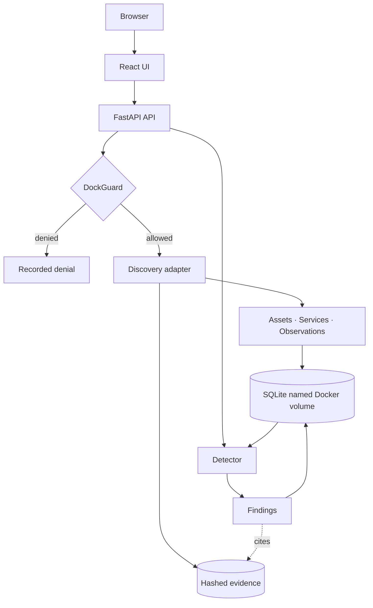

<div align="center">

# RedDock

**Discover. Validate. Prove.**

Container-native security assessment and validation platform with controlled execution and evidence-backed findings.

[](https://github.com/chriswayneh/RedDock/tags)
[](https://docs.docker.com/compose/)
[](https://www.python.org/)
[](https://github.com/chriswayneh/RedDock/actions/workflows/ci.yml)
[](LICENSE)
[](ROADMAP.md)

**Current release:** [v0.3.0](https://github.com/chriswayneh/RedDock/tags) — Phase 2 Detection · Active development

[Quick Start](#quick-start) · [Current Capabilities](#what-you-get) · [Architecture](#architecture) · [Security](#security-by-design) · [Roadmap](ROADMAP.md) · [Contributing](CONTRIBUTING.md)

</div>

---

## What This Is

RedDock explores how security tooling can become portable, container-native, policy-controlled, reproducible, and evidence-driven instead of a collection of host-specific scripts. It is designed for authorized environments and intentionally grows through small, verified phases.

Its operating model is simple: **AI proposes. Policy authorizes. Tools execute. Evidence proves.** Three of the four are implemented: an explicit authorized scope, a policy boundary called DockGuard that every target must pass, non-invasive discovery adapters that produce hashed evidence, and detectors that turn those observations into findings a reviewer can trace back to the evidence behind them. There is still no AI integration, exploitation, credential attack, active vulnerability testing, or payload of any kind.

## What You Get

| Capability | Current implementation |
| --- | --- |
| Runtime | One Dockerized application that serves the UI and API on the same origin |
| Workspaces | Dockyards that own an explicit authorized scope |
| Scope policy | DockGuard evaluates every target deterministically and fails closed |
| Discovery | Nmap host and TCP service discovery, plus a single-request HTTP origin probe |
| Inventory | Normalized assets and services that reconcile across repeat discovery |
| Observations | Dated, adapter-attributed records of what was seen — never findings |
| Detection | Deterministic detectors that read stored observations and reach nothing |
| Findings | Normalized conclusions with separate severity and confidence, deduplicated by fingerprint |
| Lifecycle | Findings resolve rather than disappear, and operator decisions survive later runs |
| CVE enrichment | A boundary with an optional local catalogue; an association, never a verdict |
| Evidence | Raw output, normalized result, and metadata per run, each SHA-256 hashed |
| Persistence | SQLite and evidence stored in a named Docker volume |
| Safety | Non-invasive profiles only; no scripting, brute force, evasion, or exploitation |

## Screenshots

<div align="center">


<sub>Findings: severity and confidence stated separately, with the detector, the observation, and the SHA-256 that supports each one.</sub>

<br><br>


<sub>The dashboard: workspace metrics and the discovery audit trail, including a run DockGuard denied.</sub>

<br><br>


<sub>The Dockyard workspace: a target must pass DockGuard before discovery can be launched.</sub>

<br><br>


<sub>Detection: the registered detectors, what each of them reads, and what a completed run produced.</sub>

</div>

## Quick Start

Docker Engine or Docker Desktop with Docker Compose is the supported way to run RedDock. Nmap ships inside the image; nothing is installed on your host.

```bash
git clone https://github.com/chriswayneh/RedDock.git
cd RedDock
docker compose up --build
```

Open [http://localhost:8080](http://localhost:8080). The health endpoint is [http://localhost:8080/api/health](http://localhost:8080/api/health), and interactive API documentation is at [http://localhost:8080/docs](http://localhost:8080/docs).

Stop the application with `docker compose down`. The `reddock-data` volume holds both the database and retained evidence and survives normal container recreation; use `docker compose down -v` only when you deliberately want to erase local data.

## How It Works

1. Create a Dockyard to represent an authorized engagement workspace.
2. Define its authorized scope: included targets, and exclusions that always win.
3. Enter a target and ask DockGuard for a decision. It answers `ALLOWED` or a specific denial with the reason and the scope entry that decided it.
4. Run a safe discovery profile. The server re-evaluates DockGuard immediately before the adapter is invoked, so an out-of-scope target is never reached.
5. Results normalize into assets, services, and observations, and the run's raw output, normalized result, and metadata are retained and hashed.
6. Run detection. It contacts nothing: every registered detector reads what the Dockyard already recorded and returns findings, each naming the rule that produced it and the observations it was drawn from.

Run the same discovery again and RedDock updates what it already knows rather than duplicating it, while every observation is kept as history. Run detection again and the same issue stays one finding whose `last_seen` moves, while an issue that is no longer reproduced is marked resolved rather than quietly removed.

## Architecture



Only one of those two paths touches a network. Discovery goes out through DockGuard to a target; detection reads what is already stored and never leaves the process, which is why it needs no scope decision.

The production image builds the React application and serves it from the same FastAPI process that exposes `/api`. There is deliberately no reverse proxy, separate frontend service, queue, or remote dependency; discovery runs on a small bounded thread pool inside the application and detection runs inline. See [ARCHITECTURE.md](ARCHITECTURE.md) for the scope model, the adapter and detector boundaries, and the trust boundaries.

## Security by Design

> **AI proposes. Policy authorizes. Tools execute. Evidence proves.**

- **Scope is explicit and server-enforced.** DockGuard evaluates every target twice — when the run is requested and again immediately before the tool is invoked. The UI cannot bypass it.
- **Denials are specific.** `denied_out_of_scope`, `denied_excluded`, `invalid_target`, and `unresolved` each carry the reason and the matching scope entry.
- **Fail closed.** Anything DockGuard cannot positively place inside the authorized scope is denied, including a scope it cannot parse.
- **Names and addresses stay separate.** A hostname is never authorized because it resolves into an authorized network, and there is no wildcard or subdomain expansion.
- **Tools never receive operator flags.** Argument vectors are generated internally from a fixed table of safe options, executed without a shell, bounded by timeouts, and built only from targets normalized to a character set that cannot form an option.
- **Dangerously broad scope is rejected.** A scope entry may not cover more than 256 addresses, and a default route is never valid.
- **Observations are not findings.** An observation records what an adapter saw and carries no severity or verdict. A finding is a separate thing: a normalized conclusion one named detector drew, which cannot exist without the observations it cites.
- **Detectors reach nothing.** A detector is handed an immutable snapshot and no session, socket, subprocess, target, or operator option. A test parses the detection package and fails the build if that stops being true.
- **A finding is checkable.** It names the detector and rule that produced it, the observations behind it, the runs involved, and the SHA-256 of the retained artifact.
- **Ratings are not inflated.** Severity and confidence are separate fields, missing hardening headers are `low`, and there is no risk score, CVSS vector, or aggregate rating, because RedDock does not compute one.
- **CVE data is never invented.** RedDock downloads none. Enrichment is optional, local, exact-match only, and never changes a severity or a status.

Read [SECURITY.md](SECURITY.md) for the authorized-use policy and the full control list.

## Repository Structure

```text
backend/       FastAPI API, DockGuard, discovery adapters, detectors, evidence, and SQLite persistence
frontend/      React and TypeScript dashboard
scripts/       Local end-to-end smoke test
docs/          Architecture decisions and project documentation
.github/       Continuous-integration workflow
```

## Documentation

| Document | Purpose |
| --- | --- |
| [Architecture](ARCHITECTURE.md) | Current system boundaries and future design seams |
| [Security](SECURITY.md) | Authorized-use policy and product safety model |
| [Roadmap](ROADMAP.md) | Phased delivery plan and clear separation of planned work |
| [Contributing](CONTRIBUTING.md) | Local checks and contribution guidelines |
| [Changelog](CHANGELOG.md) | Release history |

## Project Status

**v0.3.0 delivered Phase 2 — Detection:** the detector contract and registry, detection runs, normalized findings with separate severity and confidence, deduplication by stable fingerprint, a lifecycle that resolves rather than deletes, evidence links from every finding back to the observations and hashes behind it, and the CVE enrichment boundary.

**v0.2.1 finalized Phase 1** with consistent version metadata across the application, API, and packages.

**v0.2.0 delivered Phase 1 — Discovery:** DockGuard scope enforcement, asset/service/observation models, the Nmap and HTTP discovery adapters, discovery-run auditing, and the RedLedger evidence foundation.

**v0.1.0 delivered Phase 0 — Foundation:** a containerized React/FastAPI application, local Dockyard persistence, a dashboard, documentation, tests, and CI.

**Next: Phase 3 — Validation.** Controlled non-destructive validation, approval gates, and evidence packages are planned, not implemented. Detection concludes; it does not confirm by attempting. See the [roadmap](ROADMAP.md) for the complete phased plan.

## Contributing and Security

Contributions are welcome when they preserve the safety model and keep changes small and tested. Start with [CONTRIBUTING.md](CONTRIBUTING.md), and report potential vulnerabilities through [SECURITY.md](SECURITY.md) or GitHub Private Vulnerability Reporting.

## License

[MIT](LICENSE).

## Built With

[Python](https://www.python.org/) · [FastAPI](https://fastapi.tiangolo.com/) · [Pydantic](https://docs.pydantic.dev/) · [SQLAlchemy](https://www.sqlalchemy.org/) · [SQLite](https://www.sqlite.org/) · [Nmap](https://nmap.org/) · [React](https://react.dev/) · [TypeScript](https://www.typescriptlang.org/) · [Vite](https://vite.dev/) · [Docker](https://www.docker.com/) · [GitHub Actions](https://github.com/features/actions)

<br>

<p align="center">
  <strong>Discover. Validate. Prove.</strong><br>
  <sub>Controlled security validation, built one verified phase at a time.</sub>
</p>
