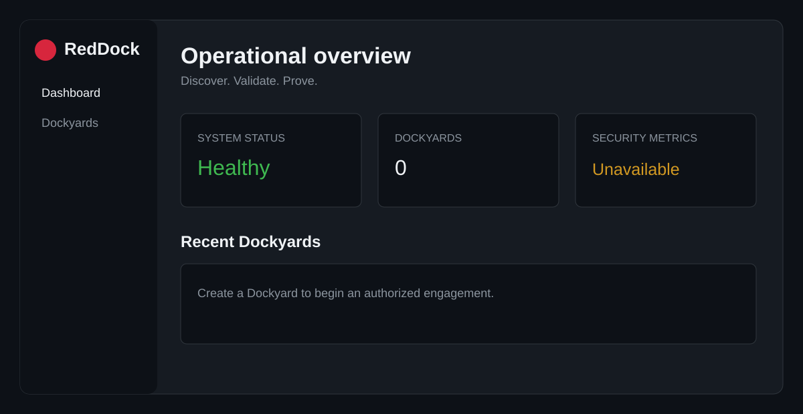

# RedDock

## Discover. Validate. Prove.

RedDock is a container-native security assessment and validation platform for authorized environments. It is being built around a simple control model: **AI proposes. Policy authorizes. Tools execute. Evidence proves.**

> Phase 0 is a working product foundation. It intentionally contains no scanning, exploitation, credential attacks, payloads, or autonomous offensive actions.



## Current capabilities

- A containerized FastAPI application with SQLite persistence
- A professional, browser-based RedDock shell
- Create, list, and inspect Dockyards (engagement workspaces)
- Health, version, and generated OpenAPI endpoints
- Safety, architecture, and contributor documentation

## Quick start

```bash
git clone <your-fork-url>
cd reddock
docker compose up --build
```

Open [http://localhost:8080](http://localhost:8080). The API health check is at [http://localhost:8080/api/health](http://localhost:8080/api/health), and interactive API documentation is at [http://localhost:8080/docs](http://localhost:8080/docs).

Stop the application with `docker compose down`. SQLite data lives in the `reddock-data` Docker volume and survives normal recreation. To deliberately erase local application data, run `docker compose down -v`.

## Architecture at a glance

One Linux container serves the Vite-built React UI and the FastAPI API. FastAPI owns the domain and persistence layers; SQLite is mounted on a named Docker volume. This small boundary keeps local deployment simple while leaving room for DockGuard, tool adapters, and RedLedger later. See [ARCHITECTURE.md](ARCHITECTURE.md).

## Development

The container workflow is the supported run path. For local feedback, install dependencies in each directory and use:

```bash
cd backend && pip install -e ".[dev]" && pytest
cd frontend && npm ci && npm run check && npm run test && npm run build
```

Useful container commands:

```bash
docker compose up --build  # start
docker compose down        # stop
docker compose build       # rebuild
docker compose logs -f     # follow logs
```

## Security and authorized use

Use RedDock only on systems you own or are explicitly authorized to assess, including labs, cyber ranges, CTFs, and training environments. Its future execution design requires explicit scope and policy authorization. Read [SECURITY.md](SECURITY.md) before contributing or deploying.

## Project status

Phase 0 is the foundation. The next planned work is Phase 1 discovery and scoped asset modeling; see [ROADMAP.md](ROADMAP.md). Contributions are welcome—start with [CONTRIBUTING.md](CONTRIBUTING.md). RedDock is available under the [MIT License](LICENSE).

