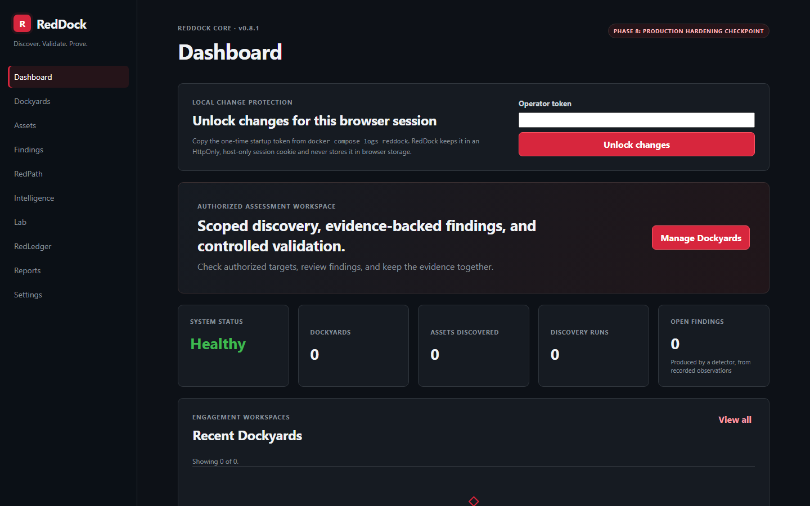
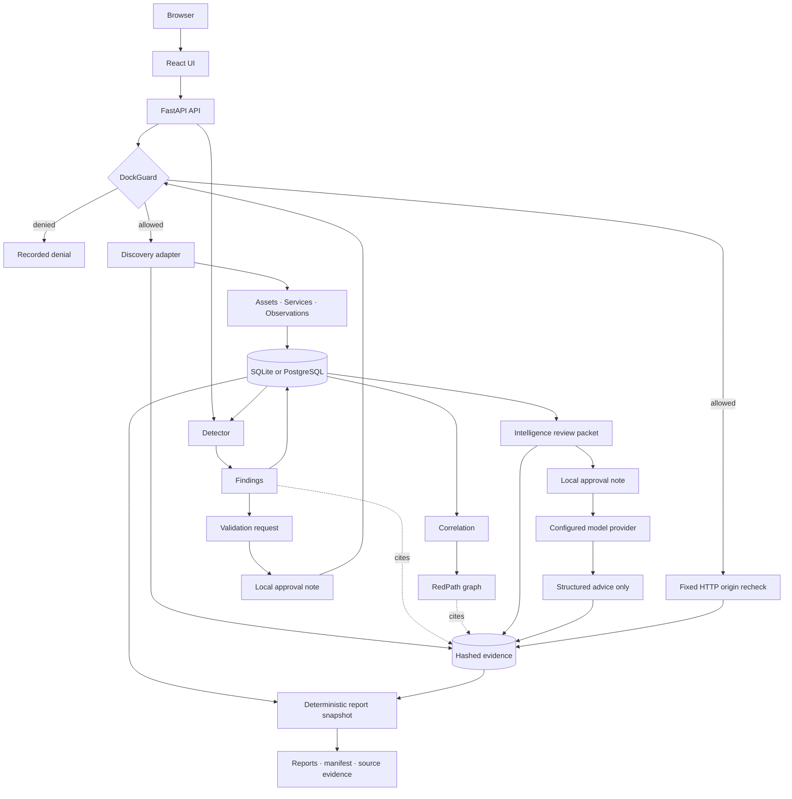

<div align="center">

# RedDock

**Discover. Validate. Prove.**

RedDock is a local security workbench for controlled checks, evidence-backed investigation, and portable reporting. I built it to explore how different AI models can help create practical tooling that anyone can run and inspect.

[](https://github.com/chriswayneh/RedDock/tags)
[](https://docs.docker.com/compose/)
[](https://www.python.org/)
[](https://github.com/chriswayneh/RedDock/actions/workflows/ci.yml)
[](https://github.com/chriswayneh/RedDock/actions/workflows/codeql.yml)
[](LICENSE)
[](ROADMAP.md)

**Current release:** [v0.8.1](https://github.com/chriswayneh/RedDock/releases/tag/v0.8.1), Phase 8 Production hardening checkpoint

[Start Here](docs/GETTING_STARTED.md) · [What It Checks](#what-it-checks-today) · [Screenshots](#screenshots) · [Security](SECURITY.md) · [Documentation](docs/README.md) · [Roadmap](ROADMAP.md)

</div>

---

## What it checks today

RedDock can perform host discovery, scan Nmap's top 100 TCP ports with light version detection, or make one bodyless HTTP-origin probe. Its built-in rules review selected HTTP security headers, TLS certificate verification results, and identified Telnet or FTP services. A separately gated lab profile expands one host to Nmap's top 1,000 TCP ports.

It does not test UDP, credentials, exploitability, response bodies, NSE scripts, brute force, payloads, or evasion. It ships no CVE feed. An optional local catalogue can associate an exact reported product and version with CVE identifiers, but that association is not proof that the service is affected.

### Current boundary

- **Local only.** The supported Compose package publishes one host-loopback port. Do not expose it to a LAN, public tunnel, proxy, or the internet.
- **No user login.** The local package uses an operator token to protect changes, but that token is an accident boundary, not identity, SSO, or shared-user access.
- **Not a certification.** Findings describe what narrow checks observed and concluded. A clean result does not prove a target is secure.
- **AI has no tools.** AI is optional and receives only a packet the operator reviews and approves. It cannot scan, change findings, or apply remediation.

## What you get

| Question | RedDock's answer |
| --- | --- |
| What did it check? | Authorized scope, completed discovery runs, and retained observations show which focused checks ran. |
| What did it find? | Rule-based findings keep severity separate from confidence and link back to what was observed. |
| What supports the result? | SHA-256-hashed evidence and named detector rules provide a traceable record. |
| What can I save or share? | Technical and plain-language reports, plus an unencrypted DockPack containing verified supporting files. |

<div align="center">

<a href="docs/screenshots/findings.png"></a>

<sub>Each finding explains the conclusion, its severity and confidence, and the evidence behind it.</sub>

</div>

## Start the stable release

For an authorized local evaluation, start from the immutable reviewed tag:

```bash
git clone --branch v0.8.1 --depth 1 https://github.com/chriswayneh/RedDock.git
cd RedDock
docker compose up --build
```

Open [http://localhost:8080](http://localhost:8080). On the first start, copy the generated operator token from `docker compose logs reddock`, enter it in the browser, and select **Unlock changes**. The token is generated once and stored in the `reddock-data` volume. If its file is removed after initialization, RedDock refuses changes instead of silently replacing it.

See the [step-by-step first-run guide](docs/GETTING_STARTED.md) for the local demonstration, shutdown instructions, and troubleshooting. Contributors can use `master`, which may contain unfinished work newer than the stable tag.

### Why I am building it

I want a security workbench that keeps scope, findings, and evidence together in one workflow. These questions guide how I build it:

- Can active checks stay narrow, explicit, and easy to audit?
- Can a finding keep a clear trail back to the evidence behind it?
- Can optional AI help explain results without receiving tools or control?
- Can the project be honest about unfinished work instead of hiding it?

I keep the source, tests, architecture notes, and tradeoffs visible so anyone interested can see how the project evolves. Passing automated checks is useful evidence, not a security certification.

#### Zero trust and least privilege

RedDock treats browser input, target output, model output, stored paths, and archives as untrusted. DockGuard checks scope immediately before target contact, tools receive fixed arguments without a shell, and stored-data features receive no target capability. The Compose application listens on a Unix socket shared only with its loopback ingress proxy; optional Ollama and PostgreSQL services do not receive that socket. Containers run with bounded resources, read-only root filesystems where supported, dropped capabilities, and `no-new-privileges`.

These are concrete controls, not a claim that RedDock is ready for shared or internet-facing use. See the [security model](SECURITY.md#zero-trust-and-least-privilege-status) and [threat model](docs/THREAT_MODEL.md).

### Technical capability reference

<details>
<summary>Expand the implementation details</summary>

| Capability | Current implementation |
| --- | --- |
| Runtime | One Dockerized application that serves the UI and API on the same origin |
| API explorer | Optional OpenAPI schema and Swagger UI, disabled by default |
| Workspaces | Dockyards that own an explicit authorized scope |
| Scope policy | DockGuard evaluates every target deterministically and fails closed |
| Discovery | Nmap host and TCP service discovery, plus a single-request HTTP origin probe |
| Inventory | Normalized assets and services that reconcile explicit state changes without guessing about unscanned ports |
| Observations | Dated, adapter-attributed records of what was seen. Observations are not findings. |
| Detection | Deterministic detectors that read stored observations and reach nothing |
| Findings | Normalized conclusions with separate severity and confidence, deduplicated by fingerprint |
| Lifecycle | Findings resolve rather than disappear, and operator decisions survive later runs |
| Validation | A separately approved, fixed HTTP-origin recheck for eligible open header findings |
| Correlation | Evidence-linked asset/finding relationships and fixed CWE classifications |
| RedPath | A graph where every edge explains its basis and names its supporting SHA-256 evidence |
| Intelligence | Optional, approval-gated model advice over an exact packet the operator reviews first |
| Local AI | Qwen3.5 4B through Ollama is the recommended default; any compatible provider remains configurable |
| Reporting | Deterministic technical and executive reports over one bounded retained snapshot, including lab-policy history |
| DockPack | Portable ZIP export with a member manifest and verified source evidence |
| CVE enrichment | A boundary with an optional local catalogue; an association, never a verdict |
| Evidence | SHA-256-hashed run artifacts, validation packages, intelligence provenance, and reporting manifests |
| Persistence | SQLite by default or PostgreSQL 17 on an internal backend network; evidence retained in a named Docker volume |
| Safety | Non-invasive profiles only; no scripting, brute force, evasion, or exploitation |
| Lab controls | Deployment opt-in plus a separate, short-lived per-Dockyard authorization and audit ledger |
| Extensions | Data-only detector manifests with strict schema checks and content-addressed provenance |

</details>

## Screenshots

<div align="center">

<a href="docs/screenshots/operator-unlock.png"></a>

<sub>First run starts empty and keeps changes locked until the local operator token is entered.</sub>

<br><br>

[Open a finding's detail view](docs/screenshots/finding-detail.png) to see its explanation and supporting evidence.

<a href="docs/screenshots/redpath.png"></a>

<sub>See how results connect. Click a relationship to inspect its supporting evidence. A connection is not proof of an exploitable attack path.</sub>

<br><br>

<a href="docs/screenshots/dashboard.png"></a>

<sub>The dashboard: workspace metrics and the discovery audit trail, including a run DockGuard denied.</sub>

<br><br>

<a href="docs/screenshots/workspace.png"></a>

<sub>The Dockyard workspace: a target must pass DockGuard before discovery can be launched.</sub>

<br><br>

<a href="docs/screenshots/detection.png"></a>

<sub>Detection: the registered detectors, what each of them reads, and what a completed run produced.</sub>

<br><br>

<a href="docs/screenshots/reporting.png"></a>

<sub>Hand off your work: generate an executive summary, a technical report, and a downloadable package of supporting evidence.</sub>

<br><br>

<a href="docs/screenshots/manifest-view.png"></a>

<sub>Manifest view: the evidence manifest is readable and clickable in the app, while the original raw JSON remains available for machine verification.</sub>

<br><br>

<a href="docs/screenshots/settings.png"></a>

<sub>Know what is running: inspect your version and deployment gates without exposing credentials.</sub>

<br><br>

<a href="docs/screenshots/swagger.png"></a>

<sub>API explorer: the built-in Swagger UI is available when the local developer flag is enabled.</sub>

<br><br>

<a href="docs/screenshots/lab-mode.png"></a>

<sub>Phase 7 lab policy: deployment opt-in, temporary per-Dockyard authorization, fixed capability bounds, immediate revocation, and the audit ledger in one view.</sub>

<br><br>

<a href="docs/screenshots/plugin-provenance.png"></a>

<sub>Detector provenance: reviewed built-ins and a data-only organization rule publish their source, passive execution model, content-addressed version, and manifest hash.</sub>

</div>

## Running and packaging choices

New to command-line tools? Use the [step-by-step first-run guide](docs/GETTING_STARTED.md), including the current development-build warning, operator unlock, local demo, plain-English glossary, and troubleshooting.

Process liveness is at [http://localhost:8080/api/health](http://localhost:8080/api/health), and database-backed readiness is at [http://localhost:8080/api/ready](http://localhost:8080/api/ready). Swagger and the OpenAPI download are disabled by default. Developers can [enable the local API explorer](docs/GETTING_STARTED.md#optional-api-explorer).

Stop the application with `docker compose down`. In the default profile, the `reddock-data` volume holds the SQLite database, retained evidence, and local operator token. It survives normal container recreation. Use `docker compose down -v` only when you deliberately want to erase local data.

Protect that volume with the [offline SQLite backup, verification, restore, and
recovery procedure](docs/BACKUP_RESTORE.md). Backups contain sensitive assessment
evidence and are not encrypted.

> **Use Compose, and do not publish port 8080 beyond loopback.** The ingress proxy binds `127.0.0.1:8080`, and only that proxy receives the application's Unix socket. The local operator token protects changes but is not user authentication and does not protect safe reads. Publishing the raw image or proxy, sharing the socket volume, or attaching another service to the ingress boundary is not supported.

### Optional intelligence provider

RedDock ships in two supported Compose shapes:

| Package | Command | Model behavior |
| --- | --- | --- |
| Core | `docker compose up --build` | No LLM runtime or weights; every non-intelligence feature works and Intelligence reports that it is disabled |
| Local AI bundle | `docker compose -f compose.yaml -f compose.ollama.yaml up --build` | Builds the fixed rootless Ollama wrapper on an internal backend network and downloads Qwen3.5 4B into a named local volume on first use |

The core/no-LLM package remains the secure default because running discovery,
detection, validation, correlation, reporting, and DockPack export never
requires a model. The optional bundle packages the runtime and provisioning
workflow, not 3.4 GB of model weights inside the RedDock image or Git history.
It is not exposed on a host port. Set `REDDOCK_LLM_MODEL` to another Ollama model
before startup, or configure any compatible local or cloud provider instead.
The rootless bundle uses a new `reddock-ollama-v2` volume, so its first start
downloads the selected model again. An older root-owned cache is left untouched;
remove that old volume only after you identify it and decide it is no longer needed.
Only loopback addresses and the internal `ollama` service are classified as local
model destinations. `host.docker.internal` crosses into the host, is classified
as external, and therefore requires HTTPS.
See [Local and configurable AI](docs/LOCAL_AI.md) for provider overrides,
data-boundary rules, storage, first-run behavior, and the approval flow.
On systems with Make, `make up` and `make up-ai` are equivalent shortcuts.

### Optional PostgreSQL

Place a strong password in the ignored file `runtime/secrets/reddock-postgres-password`, then run:

```bash
docker compose -f compose.yaml -f compose.postgres.yaml up --build
```

This keeps the ingress proxy on `127.0.0.1:8080`, adds a pinned PostgreSQL 17
service on an internal backend network with no host port, and mounts the password into both containers as a
Compose secret. It validates the database path for Phase 8; it does not enable
the future authenticated server mode. The PostgreSQL and Ollama overlays can be
combined. See [Optional PostgreSQL](docs/POSTGRESQL.md) for safe password entry,
storage, shutdown, and external-orchestrator settings.

### Optional Phase 7 controls

Lab capabilities require both a deployment-owner switch and a short-lived
per-Dockyard authorization; the API cannot enable the deployment switch. See
[Lab mode](docs/LAB_MODE.md). Organization-specific detector policy can be
installed only as bounded, data-only JSON manifests, never as executable plugin
code. See [Detector plugins](plugins/README.md).

## How It Works

1. Create a Dockyard to represent an authorized engagement workspace.
2. Define its authorized scope: included targets, and exclusions that always win.
3. Enter a target and ask DockGuard for a decision. It answers `ALLOWED` or a specific denial with the reason and the scope entry that decided it.
4. Run a safe discovery profile. The server re-evaluates DockGuard immediately before the adapter is invoked, so an out-of-scope target is never reached.
5. Results normalize into assets, services, and observations, and the run's raw output, normalized result, and metadata are retained and hashed.
6. Run detection. It contacts nothing: every registered detector reads what the Dockyard already recorded and returns findings, each naming the rule that produced it and the observations it was drawn from.
7. For an eligible open HTTP security-header finding, request validation. This records intent only. Add an approval note to recheck DockGuard immediately before RedDock sends its fixed, bodyless HTTP probe; the raw response summary, normalized conclusion, metadata, and manifest are retained as a hash-linked evidence package.
8. Run correlation. RedDock reads only stored assets, findings, observations, and hashes, then renders an explainable RedPath graph and fixed CWE classifications without contacting a target.
9. Optionally create an intelligence packet from the latest correlation. RedDock stores and hashes the exact JSON without contacting a provider. Review it and the destination, then add a separate approval note to request structured remediation and prioritization advice.
10. Generate a report snapshot. RedDock re-verifies retained evidence, renders technical and executive reports, builds a manifest, and packages the exact source artifacts into a reproducible DockPack without contacting a target or model.
11. In an isolated authorized lab, optionally enable the deployment gate and create a short-lived Dockyard grant before using the fixed extended service-discovery profile. Every authorization and decision remains in the lab audit ledger.

Run the same discovery again and RedDock updates what it already knows rather than duplicating it, while every observation is kept as history. Run detection again and the same issue stays one finding whose `last_seen` moves, while an issue that is no longer reproduced is marked resolved rather than quietly removed.

## Architecture



Discovery and the tightly bounded validation recheck are the only paths that touch a target, and both pass DockGuard immediately before contact. Detection, correlation, and reporting read only stored state. Intelligence may contact only the configured model provider after the operator reviews the exact retained packet and records a separate approval. It receives no target or tool capability. A validation or intelligence request alone makes no network contact, and reporting never does.

The production image builds the React application and serves it from the same FastAPI process that exposes `/api`. In Compose, that process listens only on a Unix socket. A small unprivileged ingress proxy owns the host-loopback TCP port and is the only service given the socket. Optional PostgreSQL and Ollama services use separate internal backend networks and receive no API socket. Discovery runs on a small bounded thread pool inside the application and detection runs inline. See [ARCHITECTURE.md](ARCHITECTURE.md) for the scope model, adapter and detector boundaries, and trust boundaries.

## Security by Design

- **Scope is explicit.** DockGuard checks every target when a run is requested and again immediately before contact. Anything it cannot place inside the allowed scope is denied.
- **Checks stay narrow.** RedDock builds fixed tool arguments internally, uses no shell, rejects dangerously broad scope, and places time limits on active work.
- **Evidence and conclusions stay separate.** Observations record what a check saw. Findings explain what a named rule concluded and must link back to supporting observations and hashes.
- **Stored-data features cannot reach targets.** Detection, correlation, and reporting receive no target or network capability. Optional AI receives only a reviewed packet and has no tools or state-changing access.
- **Rechecks require a separate decision.** Validation is limited to eligible HTTP-header findings, requires approval, and passes DockGuard again before its fixed probe.
- **Claims stay conservative.** RedDock keeps severity separate from confidence, does not treat a CVE association as proof, and does not calculate an aggregate risk score.
- **Exports verify their inputs.** Reports and DockPacks include only bounded, database-referenced files whose retained hashes still match.

Read [SECURITY.md](SECURITY.md) for the authorized-use policy and the full control list.

## Repository Structure

```text
backend/       FastAPI API, DockGuard, adapters, detectors, intelligence, reporting, evidence, and SQL persistence
frontend/      React and TypeScript dashboard
scripts/       Local end-to-end smoke test
docs/          Architecture decisions and project documentation
.github/       Continuous-integration workflow
```

## Documentation

| Document | Purpose |
| --- | --- |
| [Start here](docs/GETTING_STARTED.md) | Install, try a local assessment, understand the results, and stop without losing data |
| [Documentation guide](docs/README.md) | Choose a reading path for trying, operating, or developing RedDock |
| [Architecture](ARCHITECTURE.md) | Current system boundaries and future design seams |
| [Security](SECURITY.md) | Authorized-use policy and product safety model |
| [Threat model](docs/THREAT_MODEL.md) | Current trust boundaries, attacker stories, and Phase 8 security objectives |
| [Roadmap](ROADMAP.md) | Phased delivery plan and clear separation of planned work |
| [Local AI](docs/LOCAL_AI.md) | Recommended Ollama model and compatible-provider configuration |
| [PostgreSQL](docs/POSTGRESQL.md) | Internal Compose backend, secret handling, and current deployment boundary |
| [SQLite backup and restore](docs/BACKUP_RESTORE.md) | Offline verified backups, rollback-safe restore, and interrupted-restore recovery |
| [Lab mode](docs/LAB_MODE.md) | Independent gates, fixed capability, and audit behaviour |
| [Detector plugins](plugins/README.md) | Data-only extension schema, install path, limits, and trust model |
| [Contributing](CONTRIBUTING.md) | Local checks and contribution guidelines |
| [Changelog](CHANGELOG.md) | Release history |
| [DockPack format](docs/DOCKPACK.md) | Portable report and evidence package layout and verification |
| [Nmap corresponding source](docs/NMAP_SOURCE_OFFER.md) | Locate the exact Nmap source archives carried in security-updated images |

## Project Status

The current release is **v0.8.1, Phase 8 Production hardening checkpoint**. Its local workflow covers scoped discovery through reports and DockPack exports, plus separately gated lab controls, data-only detector extensions, and the hardened local boundary described above. See the [changelog](CHANGELOG.md) for release-by-release history.

### Phase 8 progress

Phase 8 remains in development. Current work tightens the local operator boundary, separates API ingress from optional sidecars, caps resource use, and improves first-run clarity. Dormant identity, session, OIDC, and tenant foundations remain disabled. There is no sign-in route, no supported server mode, and no shared-user deployment. See the [roadmap](ROADMAP.md#phase-8-production-polish) for technical checkpoints and remaining gates.

## Contributing and Security

RedDock is MIT-licensed and owner-directed. Bug reports and design discussion are welcome. Please read [CONTRIBUTING.md](CONTRIBUTING.md) before starting implementation work. Report potential vulnerabilities through [SECURITY.md](SECURITY.md) or GitHub Private Vulnerability Reporting, not a public issue.

## Development Approach

I use Claude Code and OpenAI Codex for implementation and review assistance. The repository source, tests, documented controls, and my review determine what ships. Contribution attribution details live in [CONTRIBUTING.md](CONTRIBUTING.md#attribution).

## License

[MIT](LICENSE).

## Built With

[Python](https://www.python.org/) · [FastAPI](https://fastapi.tiangolo.com/) · [Pydantic](https://docs.pydantic.dev/) · [SQLAlchemy](https://www.sqlalchemy.org/) · [SQLite](https://www.sqlite.org/) · [PostgreSQL](https://www.postgresql.org/) · [Nmap](https://nmap.org/) · [React](https://react.dev/) · [TypeScript](https://www.typescriptlang.org/) · [Vite](https://vite.dev/) · [Docker](https://www.docker.com/) · [GitHub Actions](https://github.com/features/actions)

<br>

<p align="center">
  <strong>Discover. Validate. Prove.</strong><br>
  <sub>Controlled security validation, built one verified phase at a time.</sub>
</p>
