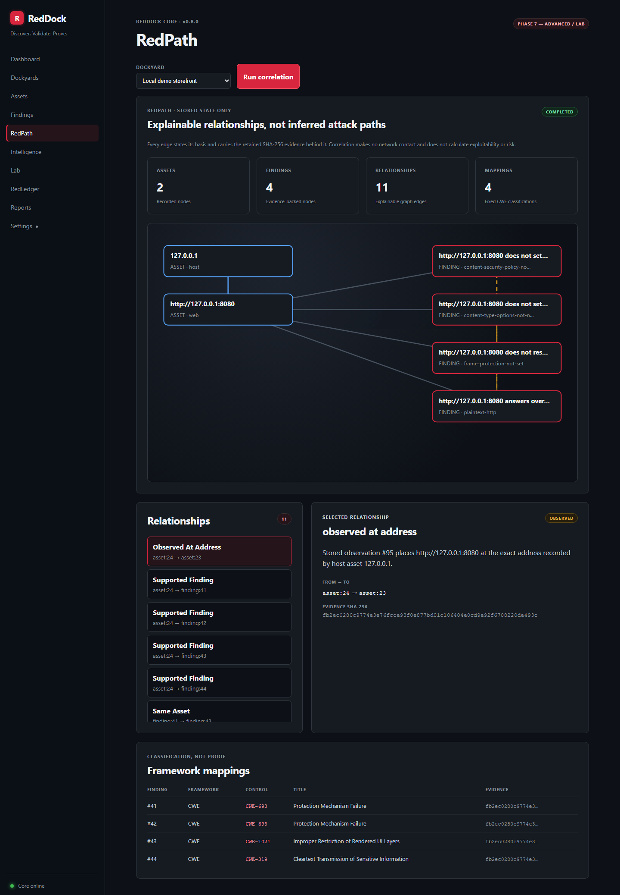
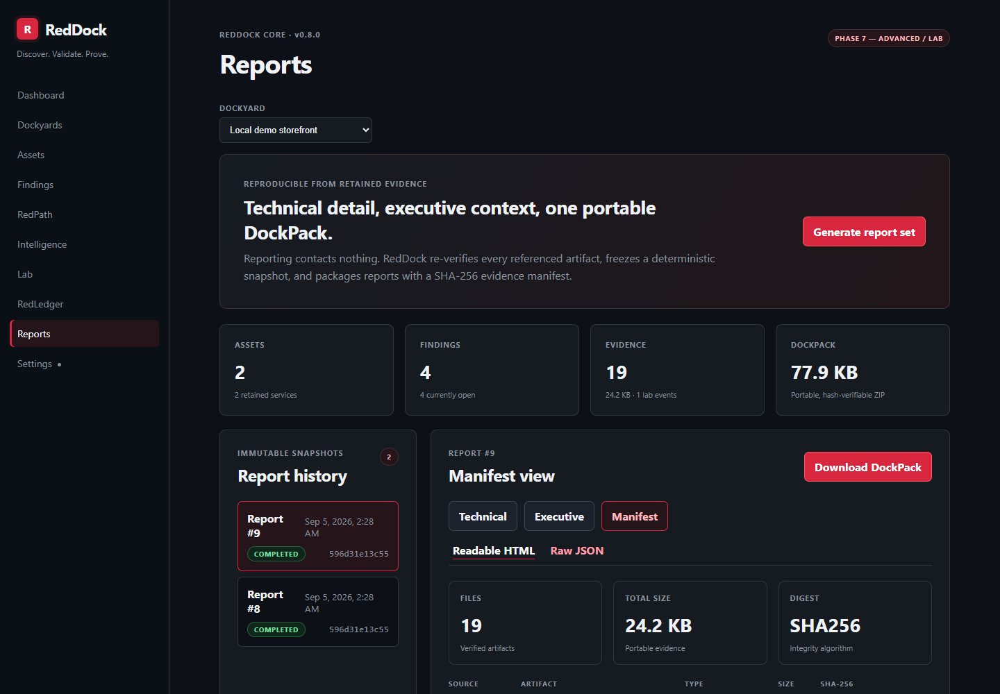
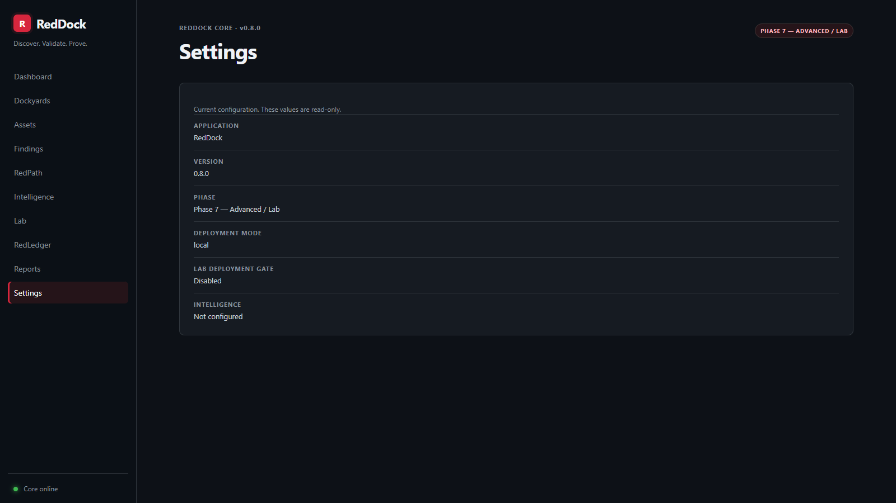
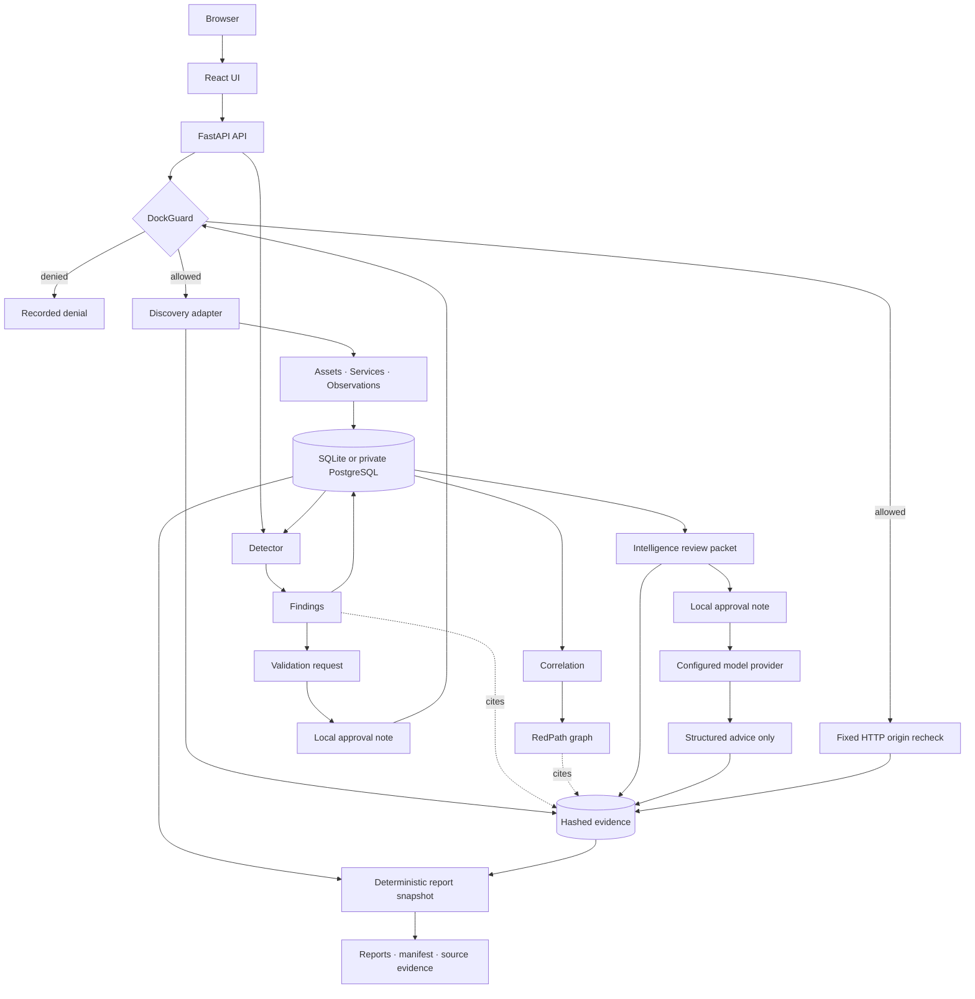

<div align="center">

# RedDock

**Discover. Validate. Prove.**

**A local security workbench built in my spare time.**

I use RedDock to explore controlled security checks, explainable findings, and evidence that stays connected to the result.

[](https://github.com/chriswayneh/RedDock/tags)
[](https://docs.docker.com/compose/)
[](https://www.python.org/)
[](https://github.com/chriswayneh/RedDock/actions/workflows/ci.yml)
[](https://github.com/chriswayneh/RedDock/actions/workflows/codeql.yml)
[](LICENSE)
[](ROADMAP.md)

**Current release:** [v0.8.0](https://github.com/chriswayneh/RedDock/releases/tag/v0.8.0), Phase 7 Advanced / Lab

**A personal open-source project by [Chris Hickman](https://github.com/chriswayneh), built with help from OpenAI Codex and Claude Code.**

**Phase 7 is complete:** separately gated lab controls, data-only detector plugins, and portable policy provenance are published and security-reviewed.

[Start Here](docs/GETTING_STARTED.md) · [What It Does](#what-you-get) · [Screenshots](#screenshots) · [Why I Am Building It](#why-i-am-building-it) · [Documentation](docs/README.md) · [Roadmap](ROADMAP.md)

</div>

---

## What This Is

RedDock is a personal project I work on in my downtime. It is a local security workbench for giving a small set of authorized systems a controlled check, then turning the results into an organized inventory, explainable findings, and downloadable reports with supporting evidence.

RedDock gives you more than an alert list. It helps answer four practical questions: **What did we check? What did we find? Why do we believe it? What can we give the person reviewing our work?**

I keep it open source under the MIT license so other curious builders and security practitioners can run it, inspect it, and learn from it. It is not a hosted service. The normal package needs no AI account or model. Optional AI gives advice only after you review what will be sent.

**Current boundary:** RedDock is a single-operator, local-only application. Phase 7 is released; Phase 8 production work is unfinished. It is not yet a shared service with working sign-in, SSO, or role-based user access. Do not expose it to the internet or use it as proof that a system is secure. See the [remaining work](ROADMAP.md#phase-8--production-polish).

## What You Get

| Your question | What RedDock gives you |
| --- | --- |
| What is there? | An inventory of hosts and services observed during controlled discovery. |
| What deserves a closer look? | Rule-based findings with separate severity and confidence, linked to the observations behind them. |
| Can I check that again? | An explicitly approved recheck for eligible HTTP security-header findings. This is not unrestricted attack execution. |
| How do these results connect? | A clickable RedPath graph explaining the relationships supported by stored evidence. |
| What can I save or share? | Plain-language and technical reports, plus a DockPack ZIP containing reports and verified supporting files. |
| Who stays in control? | You define the allowed targets. The server checks that boundary before target contact; AI cannot run tools or change findings. |

**Try it without checking anyone else's systems:** follow the [first-run guide](docs/GETTING_STARTED.md) to assess RedDock's own local web service, then generate a report. No coding or AI setup is needed, but you will need Docker and a few terminal commands.

### Why I am building it

RedDock is my hands-on place to learn, experiment, and turn security ideas into a tool I can actually run. I am especially interested in a few questions:

- Can active checks stay narrow, explicit, and easy to audit?
- Can a finding keep a clear trail back to the evidence behind it?
- Can optional AI help explain results without receiving tools or control?
- Can the project be honest about unfinished work instead of hiding it?

I direct the project and use both Claude Code and OpenAI Codex as development and review tools. The source, tests, architecture notes, and tradeoffs remain visible so anyone interested can see how it evolves. Passing automated checks is useful evidence, not a security certification.

#### Zero trust and least privilege, without the marketing gloss

RedDock applies these design rules at the boundaries it implements today. This
is not a claim that the current release is ready for shared or internet-facing
use.

| Boundary | Enforced today | Not yet claimed |
| --- | --- | --- |
| Identity and ingress | Account-free local mode binds to loopback and restricts Host values. Requesting server mode fails startup. | There is no sign-in flow or supported networked deployment. Dormant OIDC code is not connected to routes. |
| API authorization | Every route is classified as public or mapped to a permission, unknown roles deny access, and tenant-owned resources are loaded through organization-scoped queries. | The current request context is the reserved local owner, not an authenticated human identity. |
| Active operations | DockGuard checks scope immediately before target contact. Tools receive fixed arguments, bounded time, and no shell. Sensitive rechecks and model disclosure require separate approval. | RedDock cannot prove that an operator was entitled to declare a target in scope. Engagement authorization remains an operator responsibility. |
| Runtime privilege | The application container runs as a fixed non-root user, drops every Linux capability, and sets `no-new-privileges`. PostgreSQL and Ollama have no published host ports. | Sidecars retain the limited privileges their upstream entry points require. This is not a claim of host or cluster isolation. |
| Untrusted data | Browser input, target output, model output, archives, and retained evidence cross explicit validation, size, identity, and hash checks. | Automated checks reduce risk but are not a penetration test or security certification. |

### Technical capability reference

<details>
<summary>Expand the implementation details</summary>

| Capability | Current implementation |
| --- | --- |
| Runtime | One Dockerized application that serves the UI and API on the same origin |
| API explorer | Optional OpenAPI schema and Swagger UI, disabled by default |
| Workspaces | Dockyards that own an explicit authorized scope |
| Scope policy | DockGuard evaluates every target deterministically and fails closed |
| Discovery | Nmap host and TCP service discovery, plus a single-request HTTP origin probe |
| Inventory | Normalized assets and services that reconcile explicit state changes without guessing about unscanned ports |
| Observations | Dated, adapter-attributed records of what was seen. Observations are not findings. |
| Detection | Deterministic detectors that read stored observations and reach nothing |
| Findings | Normalized conclusions with separate severity and confidence, deduplicated by fingerprint |
| Lifecycle | Findings resolve rather than disappear, and operator decisions survive later runs |
| Validation | A separately approved, fixed HTTP-origin recheck for eligible open header findings |
| Correlation | Evidence-linked asset/finding relationships and fixed CWE classifications |
| RedPath | A graph where every edge explains its basis and names its supporting SHA-256 evidence |
| Intelligence | Optional, approval-gated model advice over an exact packet the operator reviews first |
| Local AI | Qwen3.5 4B through Ollama is the recommended default; any compatible provider remains configurable |
| Reporting | Deterministic technical and executive reports over one bounded retained snapshot, including lab-policy history |
| DockPack | Portable ZIP export with a member manifest and verified source evidence |
| CVE enrichment | A boundary with an optional local catalogue; an association, never a verdict |
| Evidence | SHA-256-hashed run artifacts, validation packages, intelligence provenance, and reporting manifests |
| Persistence | SQLite by default or private PostgreSQL 17; evidence retained in a named Docker volume |
| Safety | Non-invasive profiles only; no scripting, brute force, evasion, or exploitation |
| Lab controls | Deployment opt-in plus a separate, short-lived per-Dockyard authorization and audit ledger |
| Extensions | Data-only detector manifests with strict schema checks and content-addressed provenance |

</details>

## Screenshots

<div align="center">

<a href="docs/screenshots/findings.png"></a>

[Open a finding's detail view](docs/screenshots/finding-detail.png) to see its explanation and supporting evidence.

<sub>Understand each issue: what was found, how serious it is, how confident the result is, and the evidence behind it.</sub>

<br><br>

<a href="docs/screenshots/redpath.png"></a>

<sub>See how results connect. Click a relationship to inspect its supporting evidence. A connection is not proof of an exploitable attack path.</sub>

<br><br>

<a href="docs/screenshots/dashboard.png"></a>

<sub>The dashboard: workspace metrics and the discovery audit trail, including a run DockGuard denied.</sub>

<br><br>

<a href="docs/screenshots/workspace.png"></a>

<sub>The Dockyard workspace: a target must pass DockGuard before discovery can be launched.</sub>

<br><br>

<a href="docs/screenshots/detection.png"></a>

<sub>Detection: the registered detectors, what each of them reads, and what a completed run produced.</sub>

<br><br>

<a href="docs/screenshots/reporting.png"></a>

<sub>Hand off your work: generate an executive summary, a technical report, and a downloadable package of supporting evidence.</sub>

<br><br>

<a href="docs/screenshots/manifest-view.png"></a>

<sub>Manifest view: the evidence manifest is readable and clickable in the app, while the original raw JSON remains available for machine verification.</sub>

<br><br>

<a href="docs/screenshots/settings.png"></a>

<sub>Know what is running: inspect your version and deployment gates without exposing credentials.</sub>

<br><br>

<a href="docs/screenshots/swagger.png"></a>

<sub>API explorer: the built-in Swagger UI is available when the local developer flag is enabled.</sub>

<br><br>

<a href="docs/screenshots/lab-mode.png"></a>

<sub>Phase 7 lab policy: deployment opt-in, temporary per-Dockyard authorization, fixed capability bounds, immediate revocation, and the audit ledger in one view.</sub>

<br><br>

<a href="docs/screenshots/plugin-provenance.png"></a>

<sub>Detector provenance: reviewed built-ins and a data-only organization rule publish their source, passive execution model, content-addressed version, and manifest hash.</sub>

</div>

## Quick Start

New to command-line tools? Use the [step-by-step first-run guide](docs/GETTING_STARTED.md), including a local demo, plain-English glossary, and troubleshooting.

You need Git and a running Docker Engine or Docker Desktop with Docker Compose. Docker runs the application in a container; you do not need to install Python, Node.js, or Nmap separately. The first build needs internet access to download dependencies.

```bash
git clone https://github.com/chriswayneh/RedDock.git
cd RedDock
docker compose up --build
```

Open [http://localhost:8080](http://localhost:8080). Process liveness is at [http://localhost:8080/api/health](http://localhost:8080/api/health), and database-backed readiness is at [http://localhost:8080/api/ready](http://localhost:8080/api/ready). Swagger and the OpenAPI download are disabled by default. Developers can [enable the local API explorer](docs/GETTING_STARTED.md#optional-api-explorer).

Stop the application with `docker compose down`. In the default profile, the `reddock-data` volume holds both the SQLite database and retained evidence and survives normal container recreation; use `docker compose down -v` only when you deliberately want to erase local data.

Protect that volume with the [offline SQLite backup, verification, restore, and
recovery procedure](docs/BACKUP_RESTORE.md). Backups contain sensitive assessment
evidence and are not encrypted.

> **Use Compose, and do not publish port 8080 beyond loopback.** The command above binds `127.0.0.1:8080`. Local mode has no sign-in, so anything that can reach the API can add scope and start discovery runs. Publishing the port yourself, such as with `docker run -p 8080:8080`, a `0.0.0.0` bind, or a proxy forwarding a permitted `Host`, exposes that unauthenticated API to your network and is not a supported deployment.

### Optional intelligence provider

RedDock ships in two supported Compose shapes:

| Package | Command | Model behavior |
| --- | --- | --- |
| Core | `docker compose up --build` | No LLM runtime or weights; every non-intelligence feature works and Intelligence reports that it is disabled |
| Local AI bundle | `docker compose -f compose.yaml -f compose.ollama.yaml up --build` | Starts a private Ollama sidecar and downloads Qwen3.5 4B into a named local volume on first use |

The core/no-LLM package remains the secure default because running discovery,
detection, validation, correlation, reporting, and DockPack export never
requires a model. The optional bundle packages the runtime and provisioning
workflow, not 3.4 GB of model weights inside the RedDock image or Git history.
It is not exposed on a host port. Set `REDDOCK_LLM_MODEL` to another Ollama model
before startup, or configure any compatible local or cloud provider instead.
See [Local and configurable AI](docs/LOCAL_AI.md) for provider overrides,
data-boundary rules, storage, first-run behavior, and the approval flow.
On systems with Make, `make up` and `make up-ai` are equivalent shortcuts.

### Optional PostgreSQL

Set a strong `REDDOCK_POSTGRES_PASSWORD` for the Compose invocation, then run:

```bash
docker compose -f compose.yaml -f compose.postgres.yaml up --build
```

This keeps RedDock on `127.0.0.1:8080`, adds a pinned private PostgreSQL 17
service with no host port, and mounts the password into both containers as a
Compose secret. It validates the database path for Phase 8; it does not enable
the future authenticated server mode. The PostgreSQL and Ollama overlays can be
combined. See [Optional PostgreSQL](docs/POSTGRESQL.md) for safe password entry,
storage, shutdown, and external-orchestrator settings.

### Optional Phase 7 controls

Lab capabilities require both a deployment-owner switch and a short-lived
per-Dockyard authorization; the API cannot enable the deployment switch. See
[Lab mode](docs/LAB_MODE.md). Organization-specific detector policy can be
installed only as bounded, data-only JSON manifests, never as executable plugin
code. See [Detector plugins](plugins/README.md).

## How It Works

1. Create a Dockyard to represent an authorized engagement workspace.
2. Define its authorized scope: included targets, and exclusions that always win.
3. Enter a target and ask DockGuard for a decision. It answers `ALLOWED` or a specific denial with the reason and the scope entry that decided it.
4. Run a safe discovery profile. The server re-evaluates DockGuard immediately before the adapter is invoked, so an out-of-scope target is never reached.
5. Results normalize into assets, services, and observations, and the run's raw output, normalized result, and metadata are retained and hashed.
6. Run detection. It contacts nothing: every registered detector reads what the Dockyard already recorded and returns findings, each naming the rule that produced it and the observations it was drawn from.
7. For an eligible open HTTP security-header finding, request validation. This records intent only. Add an approval note to recheck DockGuard immediately before RedDock sends its fixed, bodyless HTTP probe; the raw response summary, normalized conclusion, metadata, and manifest are retained as a hash-linked evidence package.
8. Run correlation. RedDock reads only stored assets, findings, observations, and hashes, then renders an explainable RedPath graph and fixed CWE classifications without contacting a target.
9. Optionally create an intelligence packet from the latest correlation. RedDock stores and hashes the exact JSON without contacting a provider. Review it and the destination, then add a separate approval note to request structured remediation and prioritization advice.
10. Generate a report snapshot. RedDock re-verifies retained evidence, renders technical and executive reports, builds a manifest, and packages the exact source artifacts into a reproducible DockPack without contacting a target or model.
11. In an isolated authorized lab, optionally enable the deployment gate and create a short-lived Dockyard grant before using the fixed extended service-discovery profile. Every authorization and decision remains in the lab audit ledger.

Run the same discovery again and RedDock updates what it already knows rather than duplicating it, while every observation is kept as history. Run detection again and the same issue stays one finding whose `last_seen` moves, while an issue that is no longer reproduced is marked resolved rather than quietly removed.

## Architecture



Discovery and the tightly bounded validation recheck are the only paths that touch a target, and both pass DockGuard immediately before contact. Detection, correlation, and reporting read only stored state. Intelligence may contact only the configured model provider after the operator reviews the exact retained packet and records a separate approval. It receives no target or tool capability. A validation or intelligence request alone makes no network contact, and reporting never does.

The production image builds the React application and serves it from the same FastAPI process that exposes `/api`. The default profile has no reverse proxy, separate frontend service, queue, or remote dependency; the optional PostgreSQL and Ollama profiles add only private Compose services. Discovery runs on a small bounded thread pool inside the application and detection runs inline. See [ARCHITECTURE.md](ARCHITECTURE.md) for the scope model, adapter and detector boundaries, and trust boundaries.

## Security by Design

> **AI proposes. Policy authorizes. Tools execute. Evidence proves.**

- **Scope is explicit and server-enforced.** DockGuard evaluates every target twice: when the run is requested and again immediately before the tool is invoked. The UI cannot bypass it.
- **Denials are specific.** `denied_out_of_scope`, `denied_excluded`, `invalid_target`, and `unresolved` each carry the reason and the matching scope entry.
- **Fail closed.** Anything DockGuard cannot positively place inside the authorized scope is denied, including a scope it cannot parse.
- **The local API stays local.** The application accepts only the documented `localhost` and `127.0.0.1` Host values, closing the browser DNS-rebinding path to its unauthenticated loopback API.
- **Names and addresses stay separate.** A hostname is never authorized because it resolves into an authorized network, and there is no wildcard or subdomain expansion.
- **Tools never receive operator flags.** Argument vectors are generated internally from a fixed table of safe options, executed without a shell, bounded by timeouts, and built only from targets normalized to a character set that cannot form an option.
- **Dangerously broad scope is rejected.** A scope entry may not cover more than 256 addresses, and a default route is never valid.
- **Observations are not findings.** An observation records what an adapter saw and carries no severity or verdict. A finding is a separate thing: a normalized conclusion one named detector drew, which cannot exist without the observations it cites.
- **Detectors reach nothing.** A detector is handed an immutable snapshot and no session, socket, subprocess, target, or operator option. A test parses the detection package and fails the build if that stops being true.
- **Detection requires a complete bounded snapshot.** Asset, service, or observation overflow fails the run before any detector executes or any prior finding can be resolved; data-only plugins also stop at the central output-rejection boundary.
- **A finding is checkable.** It names the detector and rule that produced it, the observations behind it, the runs involved, and the SHA-256 of the retained artifact.
- **Validation is deliberately smaller than a scanner.** It applies only to eligible open HTTP header findings, targets their recorded origin, accepts no URL, payload, credential, cookie, command, or option, follows no redirect, reads no body, and requires a separate approval note. DockGuard is re-evaluated immediately before its single fixed probe.
- **Ratings are not inflated.** Severity and confidence are separate fields, missing hardening headers are `low`, and there is no risk score, CVSS vector, or aggregate rating, because RedDock does not compute one.
- **CVE data is never invented.** RedDock downloads none. Enrichment is optional, local, exact-match only, and never changes a severity or a status.
- **Correlation asserts only what evidence supports.** Exact stored identifiers produce relationships; every RedPath edge explains its basis and carries its evidence hash. No edge claims reachability, exploitability, causation, or risk.
- **Intelligence is a reviewable disclosure, not an agent.** It is disabled by default. The operator sees the exact evidence-linked packet and configured destination before separately approving transmission. The model gets no tools, targets, credentials, commands, or state-changing API, and its structured references must already exist in the packet.
- **Reports prove their inputs.** Reporting accepts no operator-selected path or source. It freezes database state under one consistent transaction, refuses active source runs, verifies every included artifact against its retained hash, confines portable names, applies pre-allocation size/count limits, renders stored text literally, and rechecks a DockPack before download.

Read [SECURITY.md](SECURITY.md) for the authorized-use policy and the full control list.

## Repository Structure

```text
backend/       FastAPI API, DockGuard, adapters, detectors, intelligence, reporting, evidence, and SQL persistence
frontend/      React and TypeScript dashboard
scripts/       Local end-to-end smoke test
docs/          Architecture decisions and project documentation
.github/       Continuous-integration workflow
```

## Documentation

| Document | Purpose |
| --- | --- |
| [Start here](docs/GETTING_STARTED.md) | Install, try a local assessment, understand the results, and stop without losing data |
| [Documentation guide](docs/README.md) | Choose a reading path for trying, evaluating, operating, or developing RedDock |
| [Architecture](ARCHITECTURE.md) | Current system boundaries and future design seams |
| [Security](SECURITY.md) | Authorized-use policy and product safety model |
| [Threat model](docs/THREAT_MODEL.md) | Current trust boundaries, attacker stories, and Phase 8 security objectives |
| [Roadmap](ROADMAP.md) | Phased delivery plan and clear separation of planned work |
| [Local AI](docs/LOCAL_AI.md) | Recommended Ollama model and compatible-provider configuration |
| [PostgreSQL](docs/POSTGRESQL.md) | Private Compose profile, secret handling, and current deployment boundary |
| [SQLite backup and restore](docs/BACKUP_RESTORE.md) | Offline verified backups, rollback-safe restore, and interrupted-restore recovery |
| [Lab mode](docs/LAB_MODE.md) | Independent gates, fixed capability, and audit behaviour |
| [Detector plugins](plugins/README.md) | Data-only extension schema, install path, limits, and trust model |
| [Contributing](CONTRIBUTING.md) | Local checks and contribution guidelines |
| [Changelog](CHANGELOG.md) | Release history |
| [DockPack format](docs/DOCKPACK.md) | Portable report and evidence package layout and verification |

## Project Status

**v0.8.0 delivers Phase 7, Advanced / Lab:** a fixed single-host extended service-discovery profile behind independent deployment and short-lived Dockyard gates, an append-only policy ledger, bounded data-only detector manifests with content-addressed provenance, optional local Qwen3.5 through Ollama, and portable lab history in reports and DockPacks.

**v0.7.0 delivers Phase 6, Reporting:** deterministic technical and executive reports, a complete SHA-256 evidence manifest, and portable DockPack exports assembled only from verified retained artifacts. Unchanged Dockyard state produces byte-identical output, and reporting contacts neither a target nor a model.

**v0.6.0 delivered Phase 5, Intelligence:** opt-in local or cloud OpenAI-compatible advice, exact packet review before disclosure, separate approval, provider and prompt-version binding, strict output validation, and hashed input/output provenance. The model receives no tools and cannot change RedDock state.

**v0.5.0 delivers Phase 4, Correlation:** stored-state-only correlation snapshots, exact-address asset relationships, evidence-linked finding correlations, fixed CWE mappings, and the RedPath graph.

**v0.4.0 delivered Phase 3, Validation:** an approval-gated, scope-rechecked, non-destructive HTTP-origin recheck for eligible open security-header findings, with `confirmed`, `not_reproduced`, or `indeterminate` outcomes, separate confidence, and a hashed raw/normalized/metadata/manifest evidence package.

**v0.3.0 delivered Phase 2, Detection:** the detector contract and registry, detection runs, normalized findings with separate severity and confidence, deduplication by stable fingerprint, a lifecycle that resolves rather than deletes, evidence links from every finding back to the observations and hashes behind it, and the CVE enrichment boundary.

**v0.2.1 finalized Phase 1** with consistent version metadata across the application, API, and packages.

**v0.2.0 delivered Phase 1, Discovery:** DockGuard scope enforcement, asset/service/observation models, the Nmap and HTTP discovery adapters, discovery-run auditing, and the RedLedger evidence foundation.

**v0.1.0 delivered Phase 0, Foundation:** a containerized React/FastAPI application, local Dockyard persistence, a dashboard, documentation, tests, and CI.

### Phase 8 progress after v0.8.0

Phase 8 is still in development. Completed checkpoints include:

- private PostgreSQL support and migration testing
- tenant isolation and least-privilege API enforcement
- secure session and browser-boundary foundations
- hardened responses, readiness checks, and dependency scanning
- complete paginated inventories, evidence lists, and run histories
- fail-closed release automation and native AMD64/ARM64 product verification
- offline, integrity-checked SQLite backup and rollback-safe restore recovery
- dormant, unregistered OIDC protocol validation and offline first-owner
  bootstrap foundations

Authentication is not enabled, and shared mode remains blocked. Authenticated
routes, user administration, scaling, PostgreSQL disaster recovery, and
production deployment hardening are still planned. See the
[roadmap](ROADMAP.md) for the detailed status.

## Contributing and Security

The latest Phase 8 checkpoints improve target exclusions, HTTP deadlines,
approval safety, evidence publication, restart recovery, PostgreSQL report
consistency, and complete-list navigation. These controls have regression
coverage. Phase 8 remains unreleased; remaining production requirements are in
the [roadmap](ROADMAP.md).

RedDock is MIT-licensed and owner-directed. Bug reports and design discussion are welcome, but unsolicited external pull requests are not currently accepted so the safety model and phase boundaries remain controlled. See [CONTRIBUTING.md](CONTRIBUTING.md), and report potential vulnerabilities through [SECURITY.md](SECURITY.md) or GitHub Private Vulnerability Reporting.

## Development Approach

RedDock is human-directed and intentionally uses a mixed-AI engineering
workflow. Claude Code and OpenAI Codex have both contributed implementation and
review work. Repository source, tests, security controls, and owner review, not
model output, remain the authority for what ships.

### AI assistance and GitHub attribution

Both OpenAI Codex and Claude Code have assisted this project. Some earlier
Claude-assisted commits contain `Co-Authored-By` trailers; Codex-assisted work
has also been committed under the owner's Git identity without those trailers.
GitHub's commit credits and automatic contributor displays therefore are not a
complete account of the tools used. They should not be read as a measure of
either tool's contribution or as vendor endorsement.

New Codex-assisted commits use the verified GitHub co-author attribution
`Co-authored-by: Codex <codex@openai.com>`, linked to
[OpenAI's Codex account](https://github.com/codex). An `AI-assisted-by` note
alone does not create a GitHub co-author credit. See the
[attribution guidance](CONTRIBUTING.md#attribution). Existing commit authorship,
release tags, and history remain unchanged; this does not retroactively assign
credit to older commits.

## License

[MIT](LICENSE).

## Built With

[Python](https://www.python.org/) · [FastAPI](https://fastapi.tiangolo.com/) · [Pydantic](https://docs.pydantic.dev/) · [SQLAlchemy](https://www.sqlalchemy.org/) · [SQLite](https://www.sqlite.org/) · [PostgreSQL](https://www.postgresql.org/) · [Nmap](https://nmap.org/) · [React](https://react.dev/) · [TypeScript](https://www.typescriptlang.org/) · [Vite](https://vite.dev/) · [Docker](https://www.docker.com/) · [GitHub Actions](https://github.com/features/actions)

<br>

<p align="center">
  <strong>Discover. Validate. Prove.</strong><br>
  <sub>Controlled security validation, built one verified phase at a time.</sub>
</p>
