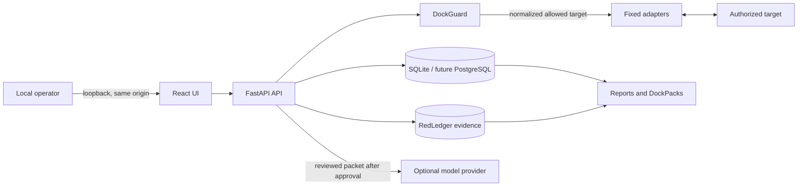

# RedDock threat model

This source-backed model covers the released local application and the
production boundary planned for Phase 8. Scenarios are design and review
hypotheses, not claims that a vulnerability has been found.

## Overview

RedDock is an evidence-first assessment workbench for an operator authorized to
examine a bounded set of systems. The released deployment is a local,
single-operator application: Docker publishes the service only on host loopback,
and the React UI and FastAPI API share one origin (`compose.yaml:5-11`,
`backend/app/main.py:54-60`). The API is not authenticated, so the trusted OS
account and loopback boundary are part of the released security model.

The browser sends structured requests to FastAPI. Active discovery passes
through DockGuard before a fixed adapter invokes Nmap or the bounded HTTP probe.
Detection, correlation, and reporting consume retained data without contacting
a target. Validation and optional intelligence use separate review/approval
steps before a fixed target recheck or model request. SQLite and RedLedger
evidence share a named volume by default (`compose.yaml:9-12`).

| Component | Responsibility | Source evidence |
| --- | --- | --- |
| UI and API | One-origin UI and typed HTTP entry points | `backend/app/main.py:54-69`, `backend/app/api.py:163-179` |
| DockGuard | Canonical scope decisions and narrow network bounds | `backend/app/dockguard.py:226-246`, `backend/app/config.py:136-145` |
| Discovery | Fixed, bounded active contact without a shell | `backend/app/discovery/nmap.py:162-169`, `backend/app/config.py:140-145` |
| Persistence | SQLAlchemy sessions and versioned Alembic upgrades | `backend/app/database.py:22-64`, `backend/app/migration_runner.py:336-354` |
| RedLedger | Bounded artifacts beneath the evidence root | `backend/app/evidence.py:72-75`, `backend/app/evidence.py:169-180` |
| Intelligence | Optional reviewed packet and bounded provider response | `backend/app/intelligence/runner.py:77-108`, `backend/app/intelligence/providers.py:50-98` |
| Reporting | Hash-checked database-referenced exports | `backend/app/reporting/runner.py:1199-1217` |
| Runtime and CI | Unprivileged process, read-only workflow token, pinned actions | `Dockerfile:24-32`, `.github/workflows/ci.yml:7-8`, `.github/workflows/ci.yml:17-18` |

### Effective resources and deployment boundaries

| Deployment | Resource or capability | Safe effective value | Recipients and enforcement | Evidence or unknowns |
| --- | --- | --- | --- | --- |
| Core Compose | HTTP API | `127.0.0.1:8080` | Local browser; loopback mapping and accepted Host names | `compose.yaml:5-7`, `backend/app/main.py:55-59`; raw public port publication is not a supported secure deployment |
| Core Compose | Database | `/var/lib/reddock/reddock.db` in `reddock-data` | RedDock process; named volume and unprivileged user | `compose.yaml:8-12`, `Dockerfile:24-29` |
| Core Compose | Evidence | `/var/lib/reddock/evidence` in `reddock-data` | RedDock and explicit export; root, regular-file, size, and digest checks | `backend/app/evidence.py:169-180`, `backend/app/reporting/runner.py:1199-1217` |
| Local AI overlay | Model endpoint | `http://ollama:11434/v1` on private Compose network | Reviewed packet to Ollama; no host port and provider recheck | `compose.ollama.yaml:5-18`, `backend/app/intelligence/runner.py:94-108` |
| PostgreSQL profile | Database and credential | Pinned PostgreSQL 17 on the private Compose network | RedDock and PostgreSQL receive one mounted secret; PostgreSQL has no host port | `compose.postgres.yaml:4-29`, `backend/app/config.py:17-86`, `backend/app/database.py:26-45` |
| External AI | Provider credential | `REDDOCK_LLM_API_KEY_FILE` preferred; direct environment value remains compatible | Configured HTTPS provider; bounded request and response | `backend/app/config.py:17-47`, `backend/app/intelligence/providers.py:62-98` |
| Detector extensions | Deployment-owned manifest directory | Reviewed JSON files only | Startup loader; symlink, path, size, schema, and namespace checks | `backend/app/detector_plugins.py:66-89`, `backend/app/detector_plugins.py:111-129` |
| Report export | DockPack derived by the server | Local operator-selected recipient after download | Hash verification, fixed paths, deterministic bounded members | `backend/app/reporting/runner.py:241-257`, `backend/app/reporting/runner.py:489-537` |
| Future server mode | Accounts, sessions, tenant data | Identity tables, local ownership, a deny-by-default permission contract, enforced route manifest, request-scoped organization context, and dormant hash-only session resolver exist, but no networked authorization mode exists | Local requests resolve to the reserved owner; unsupported modes fail startup; server mode remains unavailable until every requirement is present | `backend/app/authorization.py:7-201`, `backend/app/authorization_dependencies.py:21-70`, `backend/app/session_auth.py:47-130`, `backend/app/config.py:90-99` |

## Threat model, trust boundaries, and assumptions

### Protected assets

- Accuracy and provenance of scope, observations, findings, validation,
  correlations, advice, reports, and retained hashes.
- Confidential engagement data: targets, banners, findings, approval notes,
  model packets, reports, and DockPacks.
- The operator's authority to contact a target and the invariant that active
  operations never widen declared Dockyard scope.
- Deployment configuration, provider credentials, lab gates, database and
  evidence locations, and extension manifests.
- Future identities, organization memberships, roles, sessions, tenant
  ownership, and attributable audit history.
- Build and release integrity.

### Actors

| Actor | Starting capabilities | Capabilities not assumed |
| --- | --- | --- |
| Local operator | Controls browser, OS account, Dockyard data, approved scope, and deployment settings | Does not automatically control targets, providers, or upstream dependencies |
| Network target | Controls responses, banners, headers, timing, and failures | Does not control scope, RedDock configuration, filesystem, or approval |
| Model provider | Receives an approved packet and controls its response | Receives no tools, database session, target authority, or state-changing callback |
| DockPack recipient | Reads an intentionally shared archive | Has no implied access to the running application or source volume |
| Contributor or dependency publisher | Can propose code or publish an upstream artifact | Cannot write protected branches, releases, or workflow tokens without separate compromise |
| Future server user | Controls a browser and role-permitted fields | Must not cross organizations, elevate roles, or reuse another session |

### Boundaries and invariants

1. **Browser to API.** Pydantic rejects unknown fields
   (`backend/app/schemas.py:20-23`), but current routes have no identity
   dependency (`backend/app/api.py:163-179`). Released use is local only; future
   server mode must enforce authenticated, tenant-scoped authorization.
2. **API to active capability.** DockGuard must authorize a normalized target
   immediately before contact. Operator text never becomes a command, raw flag,
   credential, or arbitrary URL.
3. **Target to stored/displayed data.** Target strings are untrusted text, never
   markup, code, a command, or authorization.
4. **Database to RedLedger.** A stored path is not trusted by itself. Reads stay
   beneath the root, remain bounded, and match their digest
   (`backend/app/reporting/runner.py:1199-1217`).
5. **RedDock to model provider.** Only the reviewed packet may cross after
   approval. Provider output is untrusted advice with no mutation path.
6. **Deployment to extensions and lab mode.** Process settings are privileged;
   the API cannot install executable code or enable lab mode
   (`backend/app/config.py:118-134`).
7. **Export to recipient.** RedDock preserves archive integrity; the operator
   owns recipient authorization and storage after download.
8. **Future user to organization.** Every tenant lookup and mutation proves
   active membership and permission server-side. Numeric IDs alone grant no
   access, and hidden UI controls are not authorization controls.

### Assumptions and unknowns

- v0.8.x runs through the documented loopback Compose mapping. Trusted Host
  middleware validates the Host header, not the remote peer; it does not make a
  publicly bound container safe.
- DockGuard enforces declared scope but cannot prove the operator's legal
  entitlement to declare it.
- Host, Docker daemon, trusted mounted configuration, and volume compromise are
  outside the application isolation boundary.
- PostgreSQL is available only as a loopback validation profile. Production TLS
  termination, database transport policy, OIDC, and secure sessions are not
  released controls and must not be claimed until server mode tests them.
- This review was performed sequentially because independent agent delegation
  was not enabled for this task.

## Attack surface, mitigations, and attacker stories

| Priority | Scenario and capability gain | Prerequisites and impact | Existing controls | Mitigation | Evidence |
| --- | --- | --- | --- | --- | --- |
| P0 | **Hypothesis:** a remote user reaches the unauthenticated API and creates scope, starts discovery, or downloads evidence | Non-loopback publication or proxy forwarding a permitted Host; unauthorized target contact and disclosure | Supported Compose binds loopback | Keep local mode loopback-only; server mode fails startup without auth, tenant scoping, PostgreSQL, exact origins, and TLS proxy settings | `compose.yaml:5-7`, `backend/app/main.py:55-59`, `backend/app/api.py:163-175` |
| P0 | **Design hypothesis:** an authenticated user changes a numeric ID to access another organization | Future session context is misbound or a child route bypasses the Dockyard root; cross-tenant disclosure or mutation | Dockyard loaders derive organization from request context; all Dockyard routes statically reach that root; two-tenant and every-GET runtime tests return 404 across organizations; server mode is rejected | Resolve context from a verified session and add runtime IDOR matrices for mutating routes before server mode | `backend/app/services.py:10-39`, `backend/tests/test_tenancy.py:65-119`, `backend/tests/test_tenancy_contract.py:15-55` |
| P1 | Authorized hostname resolution widens contact to an excluded address | Opt-in DNS with mixed/rebound results; unauthorized contact | Narrow address bounds and separate hostname/network semantics | Preserve recorded resolution and immediate pre-execution evaluation; test rebinding and mixed results | `backend/app/config.py:136-145`, `backend/app/dockguard.py:226-246` |
| P1 | Target strings become shell flags or executable rendered content | Contact with attacker-controlled authorized target; execution or stored injection | Fixed argv with `shell=False`, typed UI, literal report rendering | Preserve adapter contract and add hostile-string browser/report tests | `backend/app/discovery/nmap.py:162-169`, `backend/app/schemas.py:20-23` |
| P1 | A changed model endpoint receives data different from the approved destination | Intelligence configured and approved; unintended disclosure | Provider identity recheck, HTTPS for external endpoints, bounded packet | Add secret-file credentials and per-organization provider policy; audit the destination | `backend/app/intelligence/runner.py:77-108`, `backend/app/intelligence/providers.py:50-98` |
| P1 | Malicious model output misleads an operator or attacks a renderer | Enabled provider controls JSON response | Strict schema, packet references, no tools or mutation | Preserve text rendering and advice labeling; adversarial renderer tests | `backend/app/intelligence/runner.py:37-51`, `backend/app/intelligence/runner.py:394-427` |
| P1 | Altered database paths export arbitrary files or false evidence | Database state modified without equal filesystem authority | Root/regular-file/size/digest verification | Preserve controls across PostgreSQL and tenancy; never accept export paths from API | `backend/app/reporting/runner.py:1199-1217`, `backend/app/evidence.py:169-180` |
| P1 | A valid but deceptive detector manifest creates misleading findings | Deployment owner installs unreviewed JSON | Data-only schema, bounds, content-addressed provenance | Require human review; allowlist or sign manifests in managed deployments | `backend/app/detector_plugins.py:66-89`, `backend/app/detector_plugins.py:111-129` |
| P1 | **Design hypothesis:** a future browser or CSRF token is stolen, fixed, replayed, or survives role revocation | Authenticated cookie routes exist; account impersonation or unauthorized mutation | Independent 256-bit tokens, hash-only storage, strict token shape, eight-hour expiry, targeted and membership-wide revocation, active user/membership checks, constant-time CSRF digest comparison, an eight-active-session cap, and explicit inactive-record cleanup | Add secure cookie issuance/rotation, exact origin checks and audit events before enabling server mode | `backend/app/session_auth.py:14-17`, `backend/app/session_auth.py:48-208`, `backend/tests/test_session_auth.py:22-157` |
| P1 | A low-role future user invokes approval or export actions | Future session resolution supplies an incorrect context; active contact, model disclosure, or evidence export | The complete route manifest is enforced; unknown roles and inactive principals are denied; negative viewer tests cover sensitive actions; server mode is rejected | Bind authenticated actor/organization to approvals and audit, then exercise every role in server-mode integration tests | `backend/app/authorization.py:15-193`, `backend/app/authorization_dependencies.py:36-70`, `backend/tests/test_authorization_enforcement.py:24-63` |
| P2 | Oversized results or dense state exhausts shared resources | High-volume authorized inputs; availability loss | Fixed run, response, snapshot, edge, and export bounds | Add throttling and metrics; exercise PostgreSQL concurrency | `backend/app/config.py:136-193`, `backend/app/intelligence/providers.py:92-99` |
| P2 | Build dependency or workflow compromise changes a release | Upstream or maintainer compromise | Pinned actions and base digests; read-only workflow token | Add SBOM/provenance, signed releases, dependency review, protected environments | `.github/workflows/ci.yml:7-8`, `.github/workflows/ci.yml:17-18`, `Dockerfile:1-8` |
| P2 | A DockPack is shared too broadly | Operator mishandles an explicit export | Explicit, bounded, integrity-verifiable download | Document classification/retention; restrict and audit exports in server mode | `backend/app/api.py:622-629`, `backend/app/reporting/runner.py:241-257` |

## Severity calibration

- **Critical:** remote unauthenticated code execution in the process or host, or
  release-pipeline compromise distributing attacker-controlled trusted code.
- **High:** remote unauthenticated active assessment or evidence access; an
  ordinary authenticated user gaining owner/admin or cross-tenant authority;
  or a scope bypass contacting a materially unauthorized target. Missing
  accounts in the loopback-only app is not high without network exposure.
- **Medium:** same-tenant role bypass exposing sensitive exports or approvals;
  stored script injection requiring an operator view; or practical
  authenticated denial of service affecting other shared-service users.
- **Low:** limited metadata disclosure, defense-in-depth gaps without session or
  tenant impact, or attribution gaps that do not enable an unauthorized action.

Severity depends on the effective deployment, attacker starting privileges, and
new capability gained. Missing exposure, identity state, or data-flow evidence
keeps a scenario hypothetical; uncertainty does not increase impact.
